# Guide d’utilisation de VoiceOver

VoiceOver est un lecteur d’écran intégré qui décrit à haute voix les éléments qui apparaissent sur l’écran de votre téléphone.
 Il permet à un utilisateur malvoyant ou nonvoyant, dyslexique ou illettré de pouvoir vocaliser tous les éléments visibles contenus dans la page. 

Lorsque VoiceOver est activé, les gestes standards effectués sur l’écran tactile donnent des résultats différents.
 Cependant, des gestes supplémentaires permettent de se déplacer à l’écran et de contrôler des éléments sélectionnés.

Il est préférable mais non obligatoire d'**activer la vibration** pour percevoir le point de déclenchement de certaines fonctionnalités.
 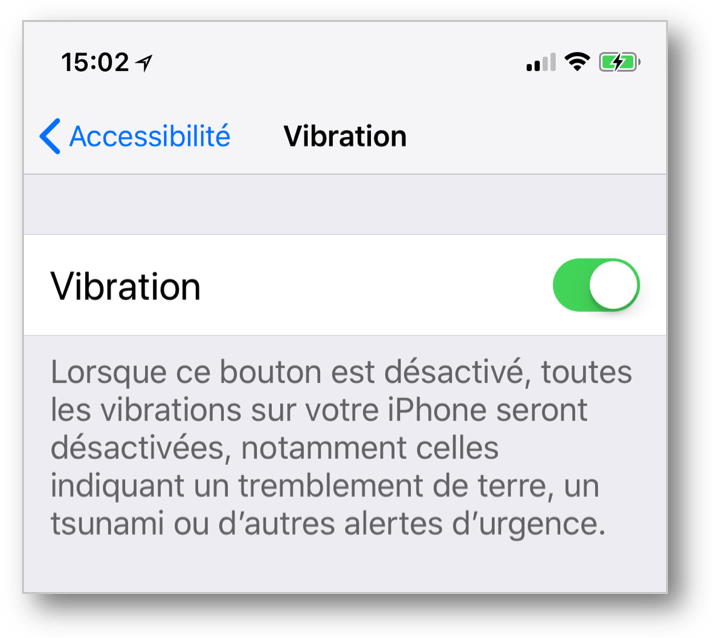
 Si cette fonction est désactivée, il est toutefois possible d'entendre un bip signalant le déclenchement qui risque néanmoins d'être parasité par la vocalisation.

Deux mouvements principaux sont importants à maîtriser pour appliquer sans problème les détails fournis par la suite :
 
Le **balayage** qui consiste à décoller le doigt de l'écran à l'issue du mouvement tout en le poursuivant.
 
Le **glissement** qui consiste à réaliser le mouvement défini en gardant continuellement le contact entre le doigt et l'écran.

Dans une première partie, nous décrirons les gestes de base liés à une utilisation courante de VoiceOver pour ensuite traiter le cas spécifique de l'iPhone X et finir avec des manipulations peu courantes mais néanmoins très utiles pour l'utilisateur avancé.

## Gestes de bases
<ul class="list-gesture">
  <li class="clearfix">
          
      <h3>Se déplacer avec un doigt sur l’écran</h3>
      
Explorer l’écran et entendre la vocalisation de l’élément qui est touché.

  </li>  
  <li class="clearfix">
      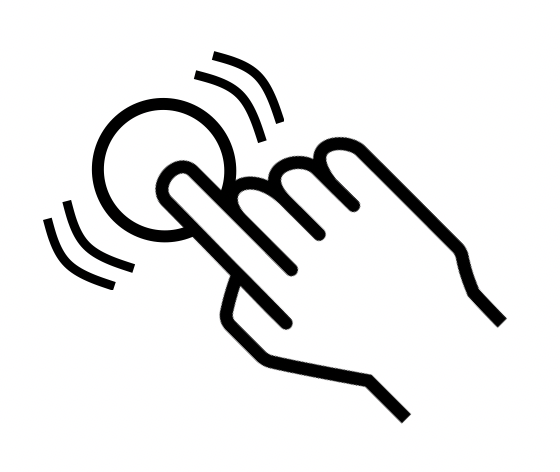    
      <h3>Double-cliquer n’importe où sur l’écran</h3>
      
Ouvrir ou activer l’élément qui a été touché (vocalisé) en dernier.

  </li>  
    <li class="clearfix">
      
        
      <h3>Balayer vers le haut ou le bas en utilisant trois doigts</h3>
      
Se déplacer verticalement sur une liste ou sur une page à condition qu’elle soit sélectionnée. Correspond à un balayage vertical.
  
  </li> 
  <li class="clearfix">
      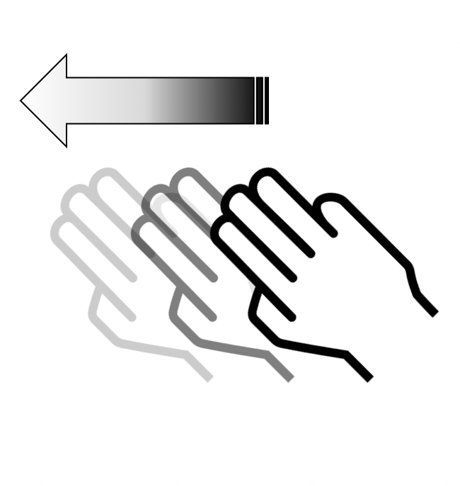
        
      <h3>Balayer vers la gauche ou la droite en utilisant trois doigts</h3>
      
Changer de page ou d’écran quand c’est possible. Correspond à un balayage horizontal.

  </li> 
  <li class="clearfix">    
      
      
      <h3>Balayer vers la gauche (resp. droite) en utilisant un doigt</h3>
      
Déplacer le focus VoiceOver sur le prochain (resp. précédent) élément.

  </li> 
  <li class="clearfix">   
      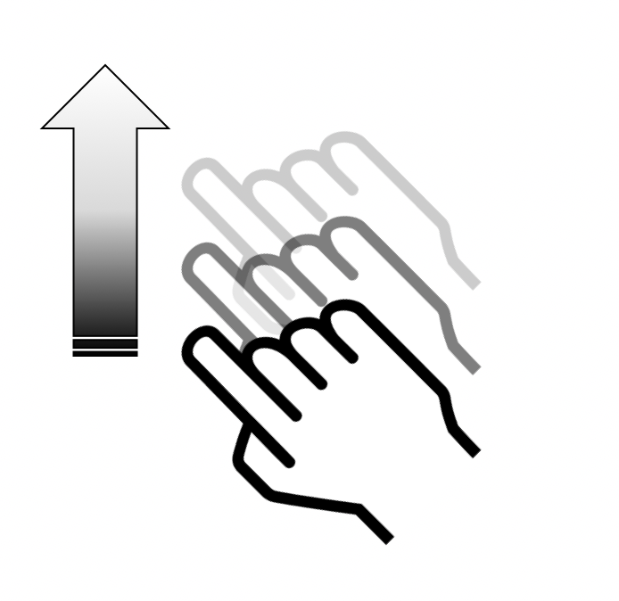    
       
      <h3>Balayer vers le haut (resp. bas) en utilisant un doigt</h3>
      
Permet d’augmenter (resp. diminuer) la valeur d’un élément ajustable.

  </li>
</ul>
## iPhoneX
L'arrivée sur le marché de ce terminal sous iOS11 avec l'absence de bouton principal a quelque peu bouleversé la gestuelle classique dont on avait l'habitude.
 Ces [nouveaux gestes de base](./lecteur-ecran-voiceover-iphonex.html) ont donc fortement impacté les manipulations VoiceOver dont les principales sont fournies ci-dessous.
- [Revenir à l'écran d'accueil.](#BackHome)
- [Accéder au multitâche.](#Multitask)
- [Accéder au centre de contrôle.](#ControlCenter)
- [Accéder au centre de notifications.](#NotificationCenter)

 Mouvement : **balayage** à partir du bas de l'écran avec **un doigt** jusqu'à sentir l'émission d'une **simple vibration** (environ au **premier quart inférieur de l'écran**).
 

  Mouvement : **balayage** à partir du bas de l'écran avec **un doigt** jusqu'à sentir une **double vibration** (environ à la **moitié de l'écran**).
 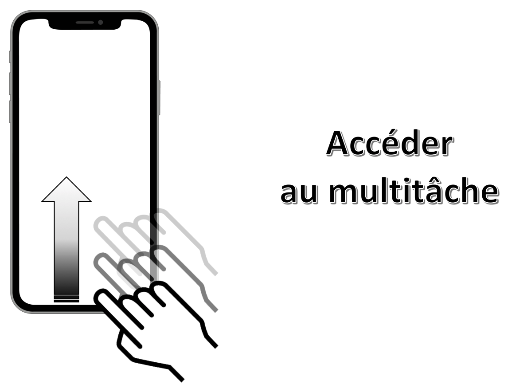

 Mouvement: **balayage avec 1 doigt** à partir du haut de l'écran jusqu'à sentir l'émission d'une **simple vibration** (environ au **premier quart supérieur de l'écran**).
 

 Mouvement: **balayage avec 1 doigt** à partir du haut de l'écran jusqu'à sentir l'émission d'une **double vibration** (environ à la **moitié de l'écran**).
 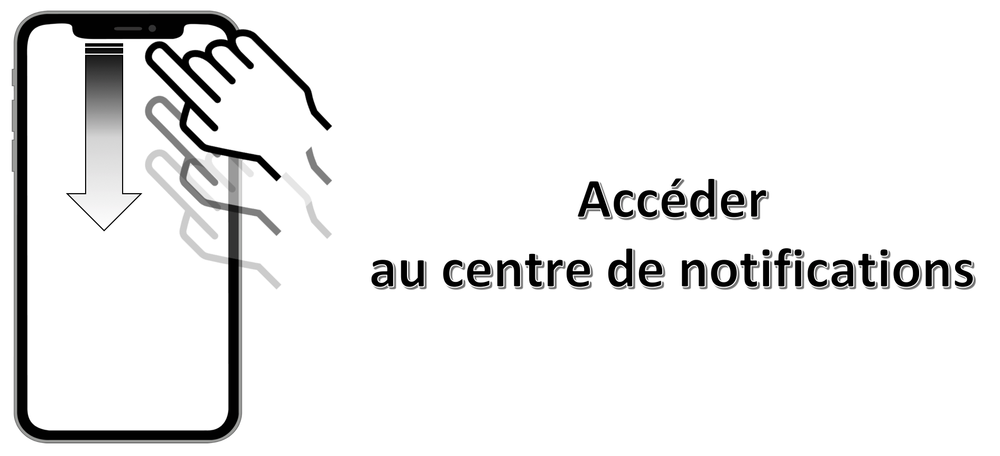
  
## Trucs & Astuces
Cette partie contient des manipulations qui ne sont pas forcément toutes très connues mais qui peuvent s'avérer très utiles sur **tout type de terminal** :
- [Lire tous les éléments à partir du haut de la page.](#ReadAllElementsFromTop)
- [Lire tous les éléments à partir de la sélection.](#ReadAllElementsFromSelection)
- [Arrêter/redémarrer la lecture automatique des éléments.](#ToggleAutomaticReading)
- [Localiser l'élément sélectionné.](#LocateSelectedElement)
- [Arrêter/redémarrer l'énonciation VoiceOver.](#ToggleSpeech)
- [Accéder au centre de contrôle.](#ControlCenterBis)
- [Accéder au centre de notifications.](#NotificationCenterBis)
- [Activer un élément sélectionné.](#ElementActivation)
- [Revenir à la page précédente.](#Scrub)
- [Trouver un élément avec le sélecteur d'éléments.](#ItemChooserList)
- [Sélectionner le premier élément d'une page.](#PageFirstElement)
- [Sélectionner le dernier élément d'une page.](#PageLastElement)
- [Activer/désactiver l'écran "rideau".](#CurtainScreen)
- [Changer la vocalisation d'un élément.](#CustomLabel)
- [Lancer une recherche](#SpotlightSearch)

 Mouvement : **balayage avec 2 doigts** du bas vers le haut n'importe où sur l'écran.
 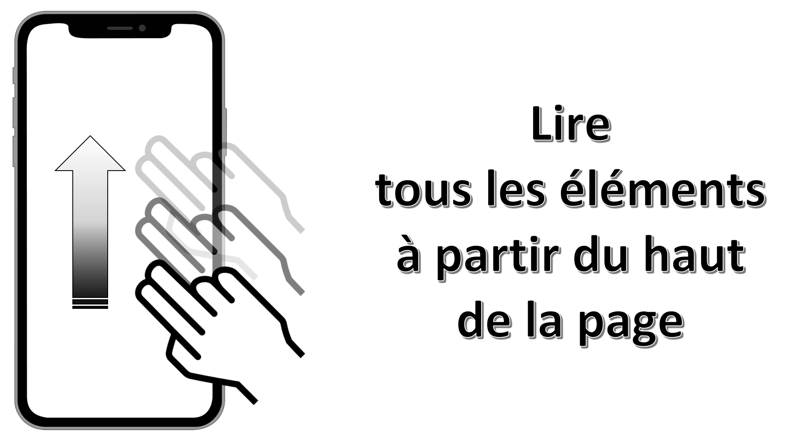

 Mouvement : **balayage avec 2 doigts** du haut vers le bas n'importe où sur l'écran.
 

 Mouvement : **simple tap avec 2 doigts** n'importe où sur l'écran.
 

 Mouvement : **simple tap avec 3 doigts** n'importe où sur l'écran.
 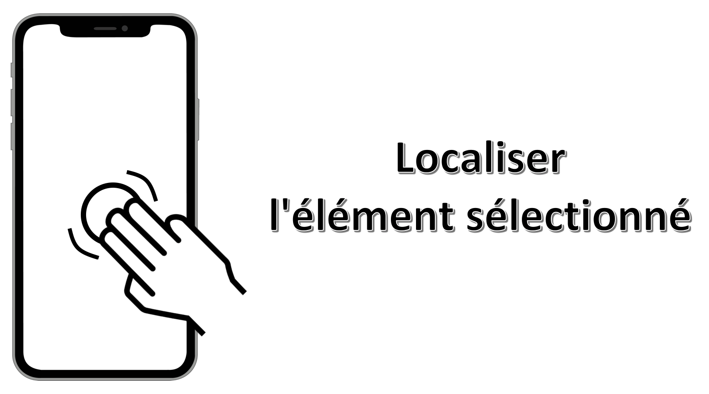

 Mouvement : **double tap avec 3 doigts** n'importe où sur l'écran.
 Si la fonctionnalité `zoom` est activée dans les réglages, il faudra réaliser un **triple tap** pour obtenir le résultat souhaité.
 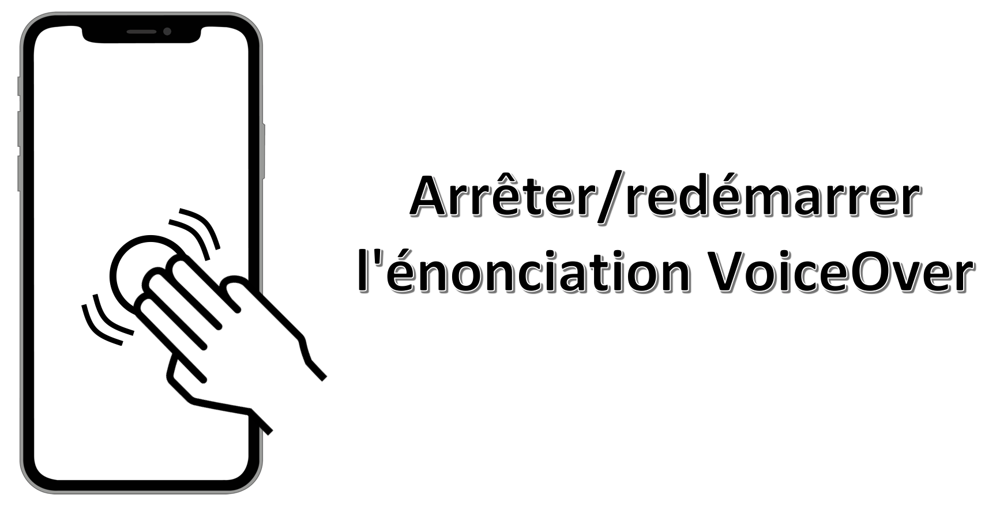

 Il faut au préalable **sélectionner un élément de la barre d'état** en haut de l'écran.
 Mouvement: **balayage avec 3 doigts** du bas vers le haut n'importe où sur l'écran.
 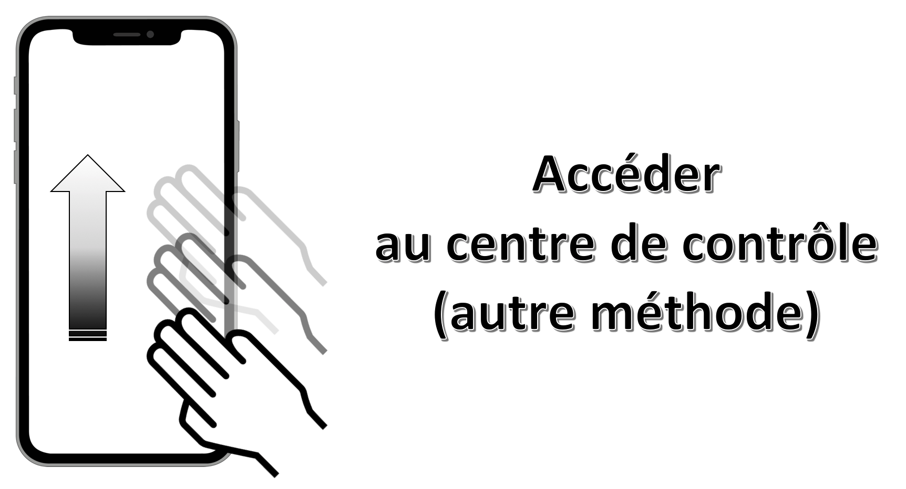

 Il faut au préalable **sélectionner un élément de la barre d'état** en haut de l'écran.
 Mouvement: **balayage avec 3 doigts** du haut vers le bas n'importe où sur l'écran.
 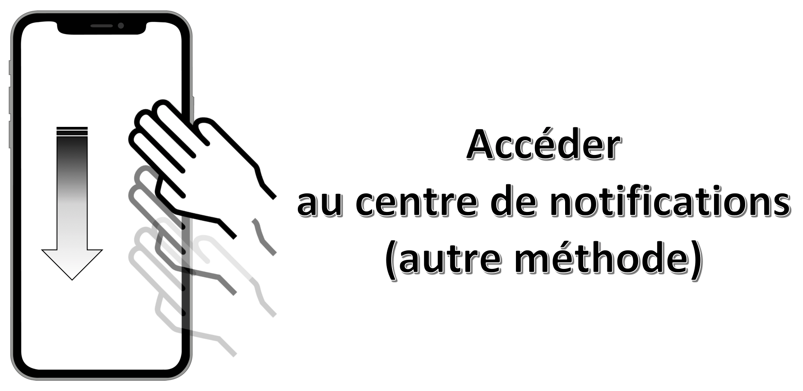

 Mouvement : **sélectionner** l'élément désiré **avec un doigt en maintenant la pression** puis effectuer un **simple tap avec un autre doigt** n'importe où sur l'écran.
 Cette gestuelle est très pratique pour taper au clavier en utilisant l'index pour sélectionner la lettre et le majeur pour réaliser le simple tap.
 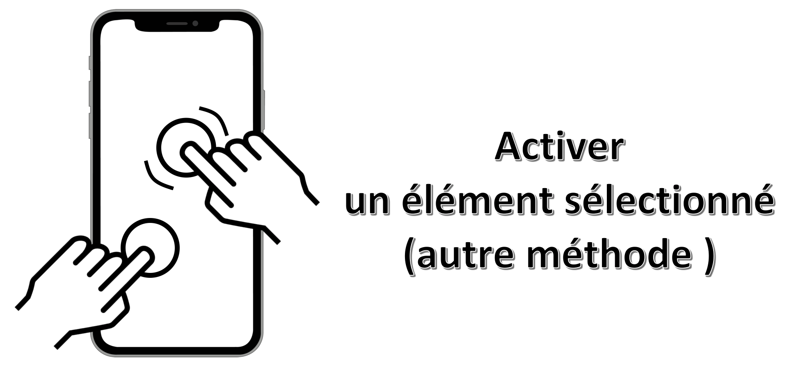

 Mouvement : **glissement avec 2 doigts en dessinant un 'Z'** n'importe où sur l'écran.
 Cette manipulation aboutit exactement au même résultat que l'appui sur le bouton retour natif d'un écran.
 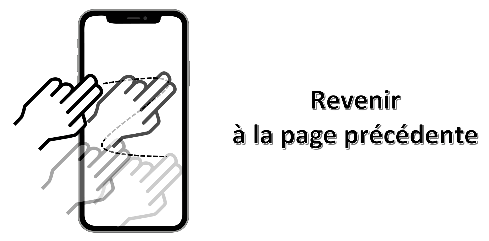

 Mouvement : **triple tap avec 2 doigts** n'importe où sur l'écran.
 

 Mouvement : **simple tap avec 4 doigts** dans la moitié supérieure de l'écran.
 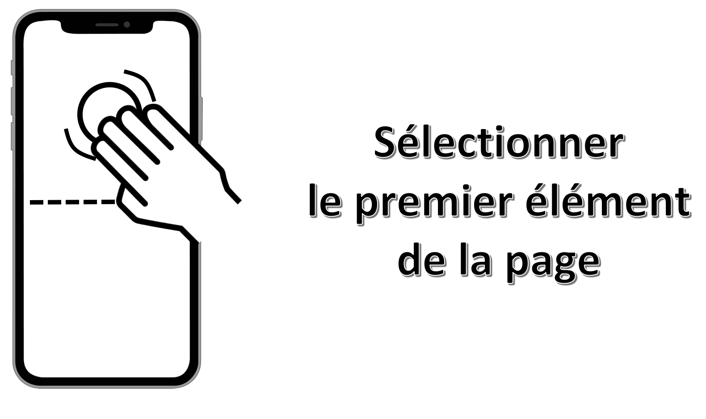

 Mouvement : **simple tap avec 4 doigts** dans la moitié inférieure de l'écran.
 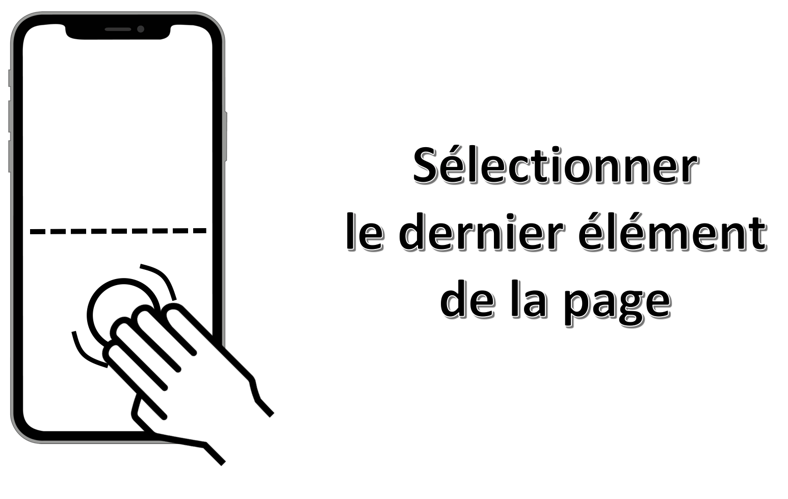

 Mouvement : **triple tap avec 3 doigts** n'importe où sur l'écran.
 Si la fonctionnalité `zoom` est activée dans les réglages, il faudra réaliser un **quadruple tap** pour obtenir le résultat souhaité.
 Cette fonctionnalité permet de continuer la navigation avec VoiceOver en ayant un écran éteint favorisant ainsi à la fois la confidentialité et la longévité de la batterie.
 

 Mouvement : **double tap avec 2 doigts en maintenant la pression** n'importe où sur l'écran.
 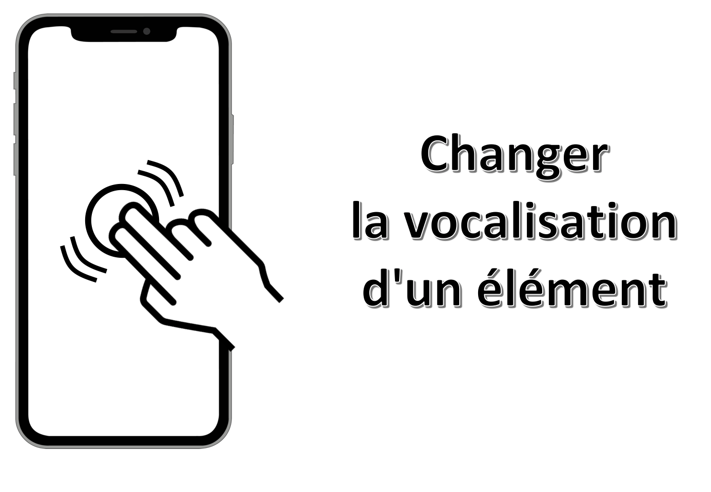

 Mouvement : **balayage avec 3 doigts** vers le bas n'importe où sur l'écran.
 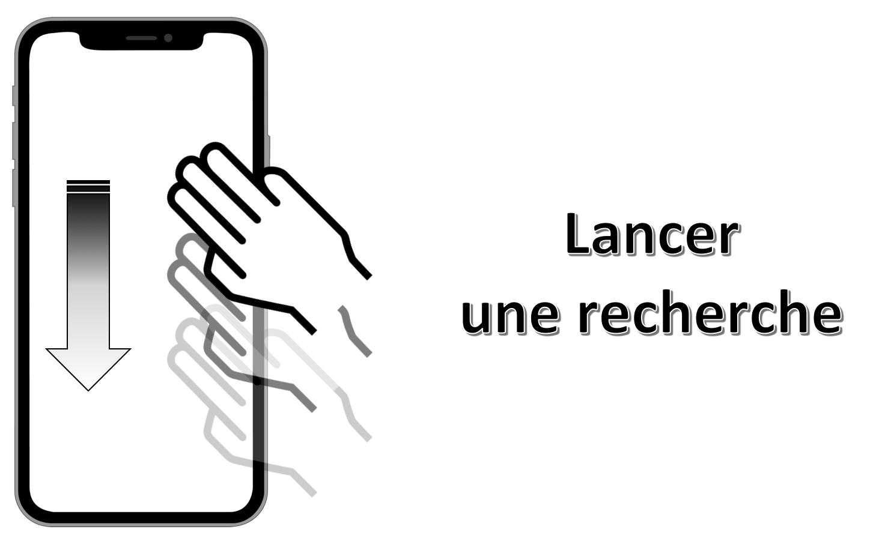

&nbsp;
<!--  This file is part of a11y-guidelines | Our vision of mobile & web accessibility guidelines and best practices, with valid/invalid examples.
 Copyright (C) 2016  Orange SA
 See the Creative Commons Legal Code Attribution-ShareAlike 3.0 Unported License for more details (LICENSE file). -->