# iOS accessibility guide

This guide aims to present the different accessibility criteria for getting an accessible iOS application. Each criterion explains for whom it is important, when it can be implemented, why it is important and the corresponding accessibility rule. The criteria are explained through code snippets and real cases examples. We invite you to install the [mDAN](./mdan.html) application for working examples of VoiceOver, the screen reader for iOS, and other assistive tools. For more information on the tool (how to activate it, how to use it…) please refer to the [VoiceOver section](./voiceover.html).

Note: code snippets are written in Swift.

## Images
**Target: ** everyone, especially people with visual impairments.  
**When: ** as of design and during development.

**Description: **

Images are often used to convey a lot of information. As the saying goes, a picture is worth a thousand words. The blind cannot see the images, it is important that they have an alternative that gives all the information conveyed by the image.
In the case of an image containing text, this text will be used for the alternative. In the case of an image that provides information as a graph, drawing or other, the alternative will contain all necessary information in the image.
  
Some images are used for decorative purposes. These pictures do not require alternative. By default, on iOS pictures are not vocalized by the VoiceOver screen reader.
Illustrations in the application are also considered decorative images. The rule is the same: there is no alternative text to add.
Icons are, conversely, widely used as buttons for various features. So they need relevant text alternatives.
  
The alternative of an image is set via the `accessibilityLabel` attribute (using the `UIAccessibility` protocol available on any children of `UIView`).

**Checklist: **

- Images with information must convey this information through their text alternative.
- Decorative images have no alternative text.

**Users’ goal: **

Access the information included in images for users who cannot access it. Blocking point: an image without textual description is unusable by people with visual impairments or those that cannot display images (mobile, low bandwidth…).

** Examples: **

  
  
By decomposing the image:  
-  no `accessibilityLabel`  
-  `buttonView.accessibilityLabel = "example_image_edit_accessibilityLabel".localized`  
-  `buttonView.accessibilityLabel = "example_image_settings_accessibilityLabel".localized`
  
## Colours

** Target: ** everyone, especially people with visual impairments, elderly people and people with vision problems (colour blindness, vision contrasts etc.)  
** When: ** as of the design phase and during development.

**Description: **

Colours have a very important role in the transmission of information.
 Some colours are associated with concepts or feelings but we must never forget the part of the population that does not correctly distinguish colours.
  The bold font type will allow a weaker contrast for the lowest font sizes.
 
  The normal font type will require a higher contrast than the previous case.
 
   With [Dynamic Type](./dev-ios.html#text-size) whose purpose is to increase the font size according to the user settings, the contrast isn't necessary fixed and must be adapted to the text size.
 

**Checklist: **

- Do not use colour as the only way of conveying information, indicating an action, requesting a response or distinguishing an element.
- The contrast between the colour of the background and the text must be appropriate *(can be measured with the Colour Contrast Analyser tool)*.

**Users’ goal: ** 

Ease of reading for all users, especially the visually impaired, or people in a very bright environment (outdoors).
Allow users who cannot distinguish colours or sensory information (colour blind, visually impaired, hearing impaired, mobile users in bright environment or in noisy environments…) to access the same information by other means.

** Tools: **
The [Colour Contrast Analyser](http://www.paciellogroup.com/resources/contrastanalyser/) application can quickly measure colour contrast levels (free for Windows and Mac).  

** Example of invalid contrast **  
The label “film | 8:40 PM…” does not have enough contrast. It will not be readable by all users.  

** Example of information conveyed through valid and invalid colour: ** 

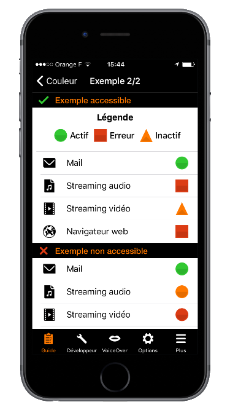

  
## Alternative text

** Target: ** everyone, especially people with visual impairments.  
** When: ** as of design, content writing and during development.

**Description: **

Text alternatives are at the core of mobile accessibility. Thanks to them, a visually impaired user can use an application without loss of information.
  
As for images, it is important to add a text alternative when information is not available for the visually impaired/blind. This is the case of components that provide information by colour, shape, position, sound… On mobile, all components can have a text alternative, it is possible to enrich the native vocalization of an element, including a simple text.
  
Space on mobile is reduced, we often use abbreviations for text. However, this raises an issue for users of screen readers that vocalize abbreviations literally. To correct these vocalizations, simply place a text alternative on the text. This alternative contains the expanded text. Note that VoiceOver can recognize some common abbreviations. For example, “etc.” is vocalized “etcetera”.
  
Some images are frequently associated with text to give information. This is the case of “unread messages” when a badge shows the number of messages to read and which describes a “message”. In this case, the solution is to set a text alternative on the text that gives all the necessary information. For example: “3 unread messages”. One can also set this alternative on the images but in this case we must make the text “invisible” to the screen reader.

The text alternative of an element is set via the `accessibilityLabel`, `accessibilityHint`, `accessibilityValue` and `accessibilityTrait` (using the `UIAccessibility` protocol available on any child of `UIView`).  
The order of vocalization is as follows: label, value, trait and hint. This order cannot be changed and vocalization is done only once.  
For more technical information on these attributes, please refer to the [textual alternatives on the developer guide](./dev-ios.html#alternatives-textuelles).

**Checklist: **

- Elements that require an alternative should have one.
- The alternative text must be clear and understandable.

**Users’ goal: **

Provide access to application information to screen reader users.

** Example: **

Below is a common example of an icon that is associated with a text (badge) to add information. In our case, the “mail” icon associated with the “3” in the badge makes us understand that we have “3 unread mails”. If no text alternative is added, two vocalizations will be read “unlabelled button” and “3”. It is obvious that we must add text alternatives.
 

## Title and header

** Target: ** everyone  
** When: ** as of design and during content writing.

**Description: ** 

The page title is the first element vocalized or seen on a mobile screen. It makes navigation easier for everyone: at any time, we know where we are in the application.  
A common mistake is to set the same title for every page of an application (or even no title at all).

iOS headers allow structuring pages providing additional information. This information is useful to the accessibility API because VoiceOver can navigate through the headers (VoiceOver wheel, header mode). This allows the user to browse the page faster.
To set an item as a header, set the `accessibilityTraits` attribute on the `accessibilityTraitHeader` value.

**Checklist: ** 

- Each screen must have its own title allowing us to know where we are in the application navigation (together with the back button).
- The elements identified as headers must be declared as headers for assistive tools.

**Users’ goal: **

Allow users to identify the topic of a page, to locate and get a clear idea of the content of the page without having to read it. Ease the navigation.

** Invalid example: **

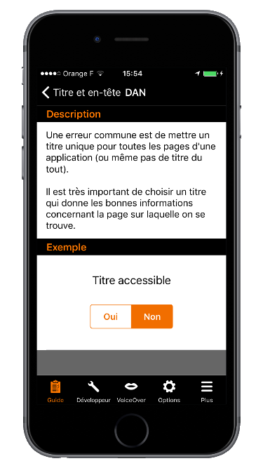
  

## Element states

** Target: ** everyone, especially people with visual impairments.  
** When: ** during development.

**Description: **

If an element does not vocalize its status, nature or state, the VoiceOver user is unable to understand what is happening on the screen. Not specifying that a view is unfolded or that we have tabs are very common examples.
  
By default, tabs in iOS are accessible. Meanwhile, it is very common to customize the tabs’ look and feel, so it is the developer’s responsibility to provide the tab state and nature to the user via the corresponding accessibility attributes. An example is available in the “Standard components” section.
  
Another common instance of elements that do not vocalize their state : expandable views. Again, thanks to the text alternative title of the view, we can vocalize the state of the view for VoiceOver users.
  
To set this kind of information, use the `accessibilityLabel` and `accessibilityTrait` attributes.

**Checklist: **

- Any item whose status changes when using the application must vocalize its status through its text alternative. For example, an item that can be selected/unselected must vocalize its state through a text alternative.

**Users’ goal: **

Allow screen reader users to access components’ information, their status, their nature so they can use them without any difficulties.

** Example: **

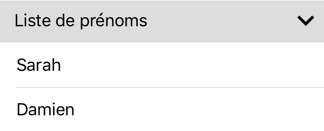
  

## Standard components

** Target: ** everyone.  
** When: ** when choosing the libraries and during development.

**Description: **

Accessibility is taken into account in native components (most of the time). Additionally, the use of standard components allows the user to be in a situation or behaviour that they are already used to. Navigation through a standard interface is more comfortable.
  
Use native components as much as possible and change their appearance. If no standard component corresponds to the need, create a dedicated component based on a standard component while keeping the navigation and accessibility consistency.

**Users’ goal: **

Improve user navigation.

** Technical Objective: **

Improve overall maintainability. Reduce development time.
  

## Touch target

** Target: ** everyone, especially people with motor impairments.  
** When: ** as of design and during development.

**Description: **  

If a touch target of a component is too small, it can prevent some users from enjoying the application. This can lead to frustration that can result in uninstalling it. Each clickable element must have a large enough touch target.

**Checklist: **

- 44 pt is the recommended touch target size for elements according to Apple (height and width); [see more information on the Apple guidelines](https://developer.apple.com/ios/human-interface-guidelines/visual-design/adaptivity-and-layout/).

**Users’ goal: **

Improve user experience.

** Valid example: **

In the examples below, the black box corresponds to the size of the interactive area.  
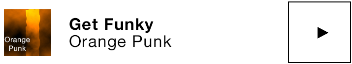

** Invalid example: **

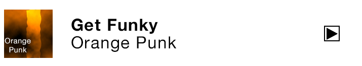

## Ghost element

** Target: ** people with visual impairments.  
** When: ** during development.

**Description: **  

Although invisible on the screen, some elements can be vocalized by the screen reader (elements positioned outside the visible area or hidden by other elements). The superposition of screens is frequent when designing mobile apps but it generates very heavy accessibility problems if it is not done properly from the start. A screen reader such as VoiceOver is able to read information from a view that is placed “below” another. But if the user is able to interact with this view, it totally disturbs navigation and it quickly becomes impossible.
  
Ghost elements are very common when creating custom alert dialogs. However, this kind of component can be accessible. Please refer to the [corresponding section on the developer guide](./dev-ios.html#masquer-des-l-ments-l-accessibilit-)

  
Read the article on the [use of fragments](https://developer.android.com/guide/components/fragments.html) for more information.

**Checklist: **

- With the screen reader, no invisible element must be read or take focus when reading a page.

**Users’ goal: **

Allow screen reader users to navigate within the application without having hidden elements disturbing the reading of the current view.

** Invalid example: **

In the example below, the custom alert dialog has a ghost element. When VoiceOver is activated it vocalizes the content behind the current view (shown in black).  
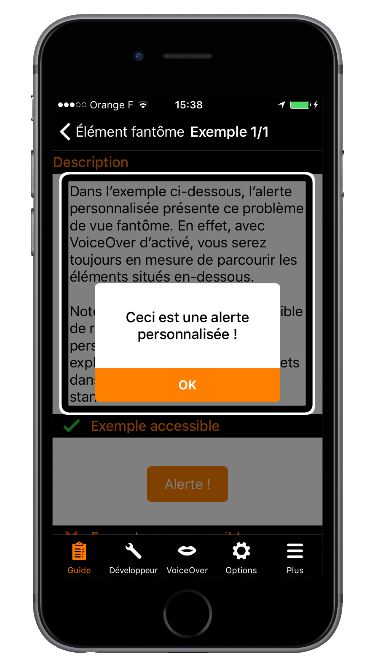

## Content Control

** Target: ** everyone and especially people with visual and cognitive deficiency.  
** When: ** as of design and during development.

**Description: **

On mobile, screen readers try to notify the user when there is a context change. In some cases, it can give constant vocalizations, and can therefore become inaudible, or prevent any user action.
The user must control the content at any time. This is especially true with interactive content. So avoid video player launching directly in full screen mode or videos starting automatically without user action or a carousel scrolling automatically for instance.

**Checklist: **

- All interactive content must be controlled by the user (adding an accessible button to exit full-screen mode for instance).

**Users’ goal: **

Allow users to keep control on the application. Allow the screen reader user to avoid noise pollution which may affect navigation.

** Technical Objective: **

Improve natural indexation.

## Changing content

** Target: ** everyone, especially people with visual impairments.  
** When: ** during development.

**Description: **

When content is dynamically modified after a user action, the screen reader must notify it. Without any voice feedback, the user does not know that the content has changed.  
If the content has changed dynamically after a user action, it is important that the screen reader is notified so that it triggers a vocalization. E.g. refreshing a list or a timer.

To start a vocalization, one must send a notification to the accessibility API via the `UIAccessibilityPostNotification` method with the `UIAccessibilityAnnouncementNotification` notification in parameter and the text to vocalize.

It is also recommended to notify the Accessibility API when there is a change of context. To do that, one must send a notification to the accessibility API via the `UIAccessibilityPostNotification`.  
There are several types of notification, but the two most used are:  
- `UIAccessibilityLayoutChangedNotification`: notify that a part of the content has changed.
- `UIAccessibilityScreenChangedNotification`: notify a global change.

For more technical information, please check out the corresponding section on the [developer guide for iOS](./dev-ios.html#informer-d-une-modification-sur-la-page).

**Checklist: **

- With a screen reader, make sure that dynamic changes are vocalized.

**Users’ goal: **

Provide access to changing content to screen reader users.

## Horizontal scroll

** Target: ** everyone, especially people with visual impairments.  
** When: ** as of design and during development.

**Description: **

A horizontal scroll can be very difficult to detect if no visual feedback is displayed to help the user understand that there are several pages.
Do not hesitate to display a view to indicate a horizontal scroll (dots on `UIPageControl` for example). When necessary, also add “next” and “previous” buttons.

**Checklist: **

- The horizontal scrolls are visually indicated.
- It must be possible to switch pages for screen reader users.

**Users’ goal: **

Provide a visual indication to users when there is horizontal scroll. Allow screen reader users to scroll horizontally.

** Valid example: **

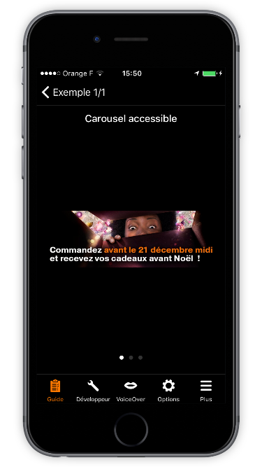

** Invalid example: **

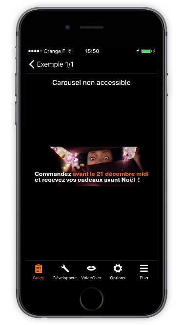

## Form

** Target: ** everyone, especially people with visual impairments.  
** When: ** as of design and during development.

**Description: **

Binding the form fields with their labels provides an additional vocalization allowing the user to understand what happens when filling out a form field.
  
We must use the `accessibilityLabel` attribute to associate a label to a form field.

**Checklist: **

- Form fields must vocalize their labels.

**Users’ goal: **

Improve navigation by improving the overall understanding of the page, because form fields describing the expected input are easier to fill for visually impaired users.

## Reading order

** Target: ** people with visual impairments.  
** When: ** during development.

**Description: **

The reading order allows the screen reader user to get their bearings and to ensure functional coherence. It is therefore important to pay attention to it.
  
By default, the reading order of voice synthesis depends on the “logical” reading order (in France), from left to right and top to bottom. However, there are some cases where the screen reader cannot determine the correct order, and uses the order of <abbr>xml</abbr> elements, leading to inconsistent vocalizations.
  
It is possible to redefine the VoiceOver reading order using the [`UIAccessibilityContainer`](https://developer.apple.com/library/ios/documentation/UIKit/Reference/UIAccessibilityContainer_Protocol/). The reading order is defined in a table. It is often useful to use the `shouldGroupAccessibilityElement` attribute to have a correct reading order in a sub-part of the page.  

**Checklist: **

- Traversal order (VoiceOver) is logical and coherent.

**Users’ goal: **

Ensure logic order and coherent reading to screen reader users.

** Example: **
In this example, the default playback order depends completely on the implementation and on the order of element declaration. In this case: `vol+, vol-, 1, 2, 3, 4, 5, 6, 7, 8, 9, p+, p-, 0`. A more consistent reading order is `1, 2, 3, 4, 5, 6, 7, 8, 9, 0, vol +, vol-, p + p-`.
 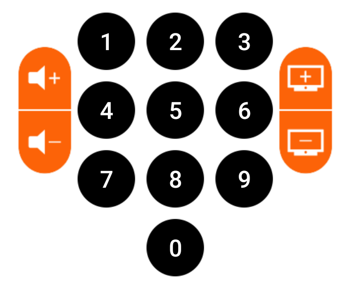

## Language

**Target : ** people with visual impairments.  
**When: ** during development.

**Description: **

VoiceOver vocalization uses the default language of the mobile. Sometimes some words / texts of an application are in a different language. In order to make them properly understandable, they have to be declared in that specific language.  

To change VoiceOver language pronunciation of a word or a text, use the `accessibilityLanguage` attribute, available via the `UIAccessibility` protocol.

**Checklist: **

- The words / text in a different language than the rest of the application should be vocalized in their corresponding language

**Users’ goal: **

Ensure the understanding of the application text.

## Screen orientation
**Target&nbsp;: ** everyone, especially people with visual and/or motor impairments.  
**When&nbsp;: ** as of design and during development.

**Description&nbsp;: ** the screen orientation mustn't impact the access of an application content.
 It's highly recommended to :
- **Implement both the portrait and the landscape modes** to be easily toggled by the user if it doesn't go against some functional constraints of the application itself (`serious game` for instance).
- Provide for iPad screen sizes in order to facilitate reading and gestures.

**Checklist&nbsp;: **

- Perfectly detailed design guideline including all the screens to be implemented with their possible orientation constraints.
- Very accurate definition of the way the transitions between portrait and landscape modes should occur.
- Portrait and landscape modes flawless adaptation to the content thanks to a bunch of graphic tests (very important for the `Dynamic Type`).
- Appropriate settings in the integrated development environment.
 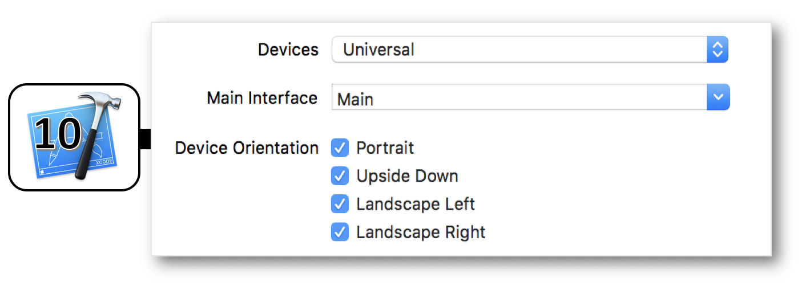

**Users’ goal&nbsp;: ** improve a better legibility of the content.  

## Accessibility options
**Target&nbsp;:** everyone.  
**When&nbsp;:** as of design and during development.

**Description&nbsp;:** the accessibility options located in the mobile settings are all about to improve the experience of an impaired user who can be significantly helped by these options.

It's then primordial :
- To **understand perfectly** each one of these options that can have an impact during the conception or the implementation periods of an application.
- To ** test** each appropriate option so as to be sure that its purpose is completely taken into account inside the application.

The full list of these options including their purpose and their coding name is defined hereunder :
1. [Increase Contrast](#optionA11Y_contraste)
2. [AssistiveTouch](#optionA11Y_assistiveTouch)
3. [Bold Text](#optionA11Y_bold)
4. [Subtitles & Captioning](#optionA11Y_closedCaption)
5. [Greyscale](#optionA11Y_grayScale)
6. [Guided Access](#optionA11Y_guidedAccess)
7. [Invert Colours](#optionA11Y_inverserLesCouleurs)
8. [Mono Audio](#optionA11Y_audioEnMono)
9. [Reduce Motion](#optionA11Y_limiteVisuel)
10. [Reduce Transparency](#optionA11Y_reductionTransparence)
11. [Shake to Undo](#optionA11Y_secouerPourAnnuler)
12. [Speak Screen](#optionA11Y_lecturePage)
13. [Speak Selection](#optionA11Y_speakSelection)
14. [Switch Control](#optionA11Y_switchontrol)
15. [VoiceOver](#optionA11Y_voiceOver)

- **Increase Contrast** *(UIAccessibilityDarkerSystemColorsEnabled)* : see the [WWDC 2018 video](./dev-ios-wwdc-18230.html#Contrast).
 

- **AssistiveTouch** *(UIAccessibilityIsAssistiveTouchRunning)* : displays the homonymous menu in foreground, whatever the runnning application.
 

- **Bold Text** *(UIAccessibilityIsBoldTextEnabled)* : see the [WWDC 2018 video](./dev-ios-wwdc-18230.html#Sizing).
 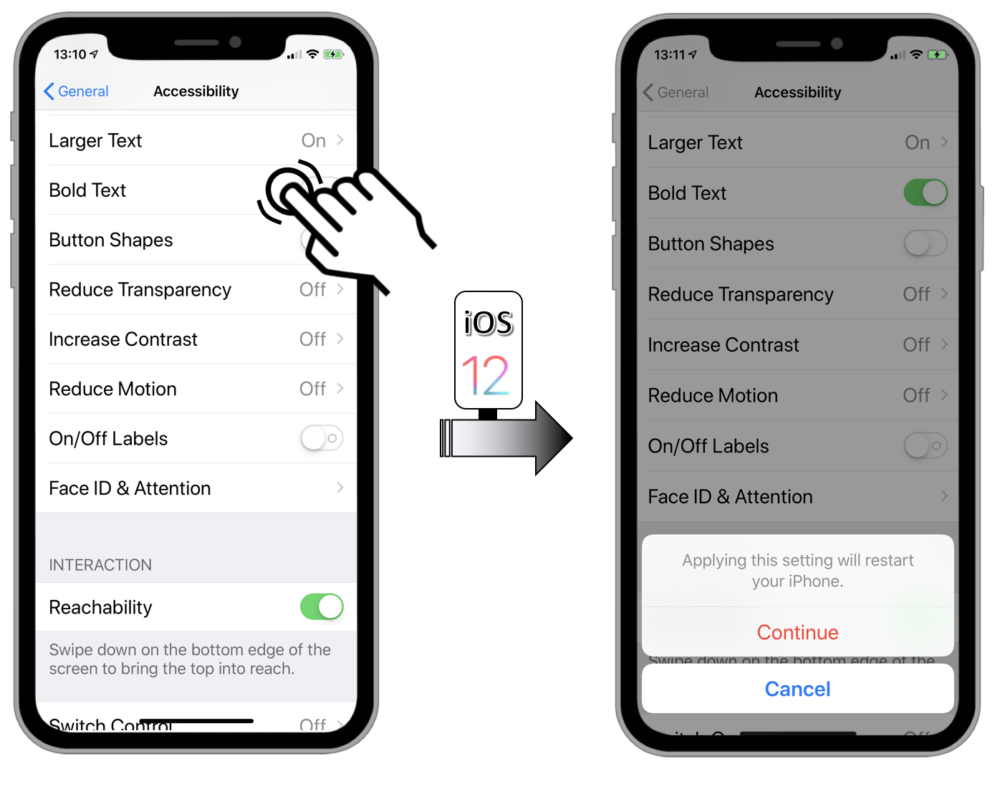

- **Subtitles & Captioning** *(UIAccessibilityIsClosedCaptioningEnabled)* : displays closed captioning or subtitles when available in the `appTV` or `Videos` app.
 

- **Greyscale** *(UIAccessibilityIsGrayscaleEnabled)* : makes the display more readable for color blind people.
 

- **Guided Access** *(UIAccessibilityIsGuidedAccessEnabled)* : restricts use of a single application.
 

- **Invert Colours** *(UIAccessibilityIsInvertColorsEnabled)* : reduces glare and eye strain thanks to a very helpful mode for visual impaired people.
 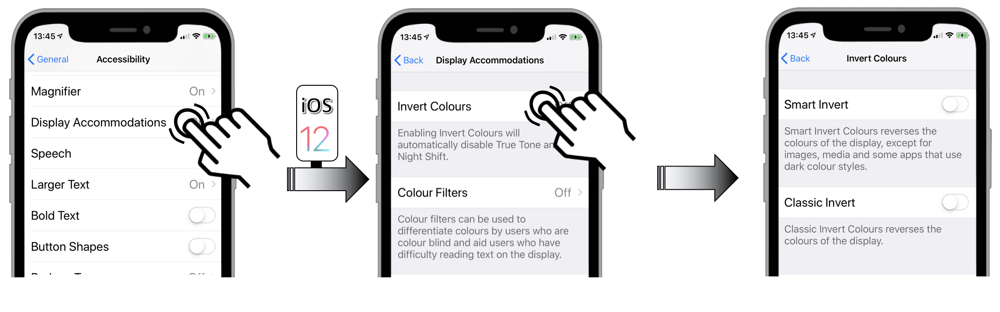

- **Mono Audio** *(UIAccessibilityIsMonoAudioEnabled)* : allows a complete hearing understanding with headset on without missing a word or a sound for people who are hard of hearing or deaf in one ear.
 

- **Reduce Motion** *(UIAccessibilityIsReduceMotionEnabled)* : see the [WWDC 2018 video](./dev-ios-wwdc-18230.html#Motion).
 

- **Reduce Transparency** *(UIAccessibilityIsReduceTransparencyEnabled)* : see the [WWDC 2018 video](./dev-ios-wwdc-18230.html#TransparencyAndBlurring).
 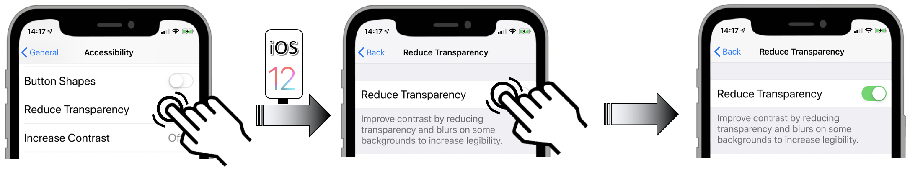

- **Shake to Undo** *(UIAccessibilityIsShakeToUndoEnabled)* : displays a menu to undo an action, preventing from holding backspace and watching all the letters disappear one by one for instance.
 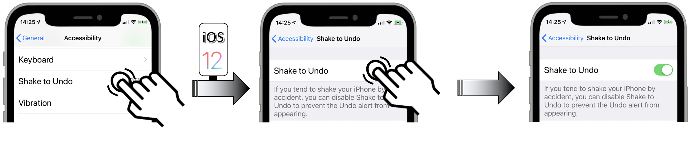

- **Speak Screen** *(UIAccessibilityIsSpeakScreenEnabled)* : launches the vocalization of the screen content.
 

- **Speak Selection** *(UIAccessibilityIsSpeakSelectionEnabled)* : displays a menu that suggests to speak the selection that fired it.
 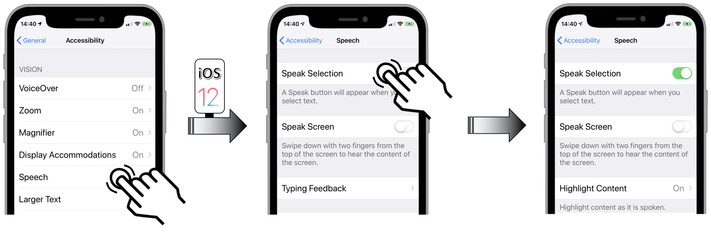

- **Switch Control** *(UIAccessibilityIsSwitchControlRunning)* : activates the feature in `point scanning mode` or in `item scanning mode`.
 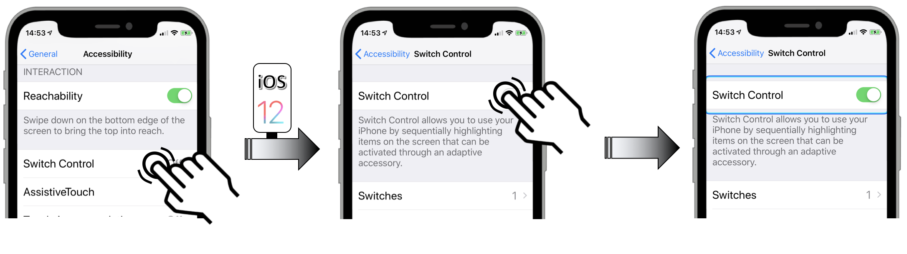

- **VoiceOver** *(UIAccessibilityIsVoiceOverRunning)* : launches the screen reader.
 

 Once activated, if the accessibility option has no result in the application running, it's **highly recommended** to keep oneself posted of the impacted options states so as to provide the best experience to the user.
 The full list of the accessibility options with their dedicated notification is located in the [developer part](./dev-ios.html#accessibility-options) of this site.
  It may be particularly interesting to keep track of these options (de)activations with kind of indicators in order to have a better understanding of the users habits and to implement improvements accordingly.  

<!--  This file is part of a11y-guidelines | Our vision of mobile & web accessibility guidelines and best practices, with valid/invalid examples.
 Copyright (C) 2016  Orange SA
 See the Creative Commons Legal Code Attribution-ShareAlike 3.0 Unported License for more details (LICENSE file). -->