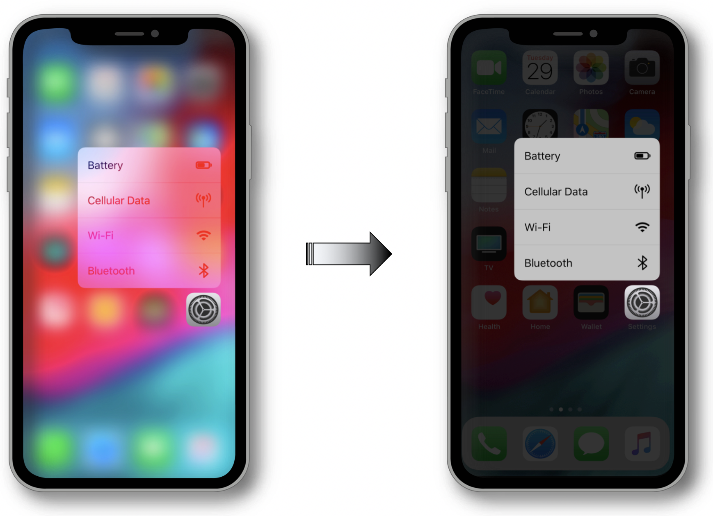
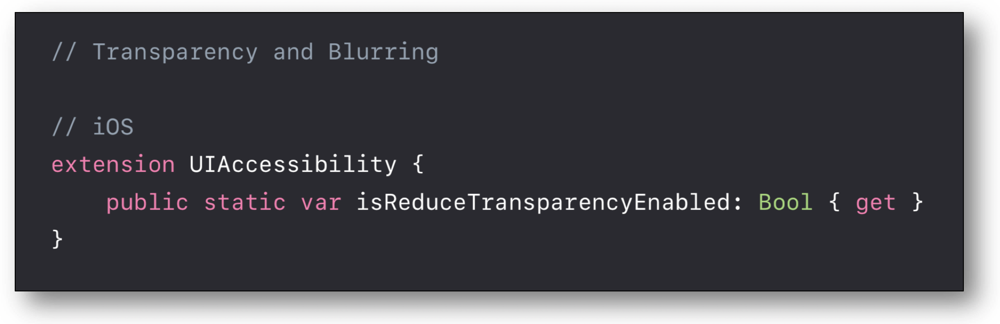
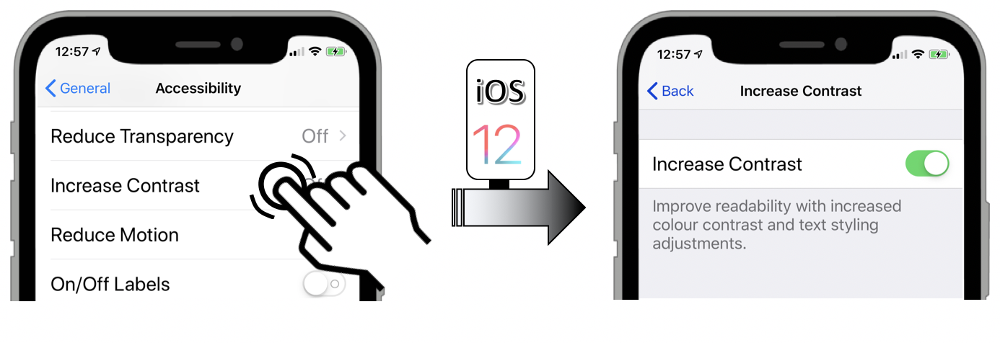
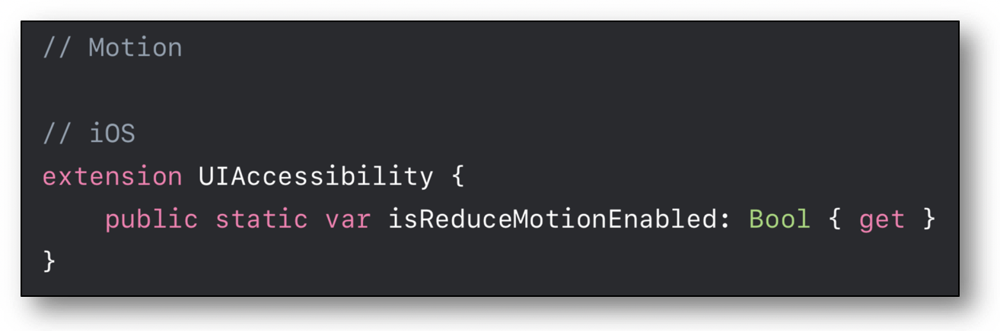

# WWDC 2018 : Deliver an exceptional accessibility experience

This video available on the **official Apple website** ([session 230](https://developer.apple.com/videos/play/wwdc2018/230/)) aims at highlighting the essential elements that will provide an optimal user experience for visual impaired people.
 
  Various contents and their video timelapse are indicated hereunder :

- [Transparency and blurring](#TransparencyAndBlurring) (03:07)
- [Contrast](#Contrast) (04:38)
- [Sizing](#Sizing) (07:04)
- [Motion](#Motion) (08:48)
- [UIAccessibilityElement](#UIAccessibilityElement) (21:03)
- [Adjustable values](#AdjustableValues) (21:44)
- [Custom actions](#CustomActions) (23:49)
- [Accessibility modal view](#accessibilityViewIsModal) (25:02)
- [Notifications](#Notifications) (25:13)
- [Demo](#Demo)
    - [How to render a carousel perfectly VoiceOver understandable ?](#DemoSetCarousel) (25:53)
    - [How to synchronize the selected carousel element with the displayed data ?](#DemoUpdateData) (30:53)
    - [How to gather actions with an elements regroupment ?](#DemoCustomActions) (33:05)
    - [How to avoid selections behind a 'Modal View' ?](#DemoModalView) (34:32)
    - [Final rendering with an optimized VoiceOver implementation.](#DemoExceptionalVoiceOverExperience) (35:38)

The latest content points out an amazing application for :

- The developers interested in finding out detailed explanations about many VoiceOver implementations.
- Those who are willing to figure out how a mobile application should interact with VoiceOver to obtain an optimal user experience (see '[Final rendering with an optimized VoiceOver implementation](#DemoExceptionalVoiceOverExperience)').

Thereafter, the selection of a title will give rise to the video playback on the Apple website directly at the proper moment.
  

### [Transparency and blurring (03:07)](https://developer.apple.com/videos/play/wwdc2018/230/?time=187)
Since iOS 8, classes such as `UIBlurEffect` and `UIVisualEffectView` perfectly handle the blurring effect of an image.
 However, this could give rise to sighting difficulties for some people having visual impairments.
 In this case, there's a possibility for the user to drastically weaken these effects by activating the appropriate [accessibility option](./criteria-ios.html#accessibility-options) in his settings.
 
 The result is a darker background that may become completely uniform under certain circumstances.
 
 The `isReduceTransparencyEnabled` property value is available in the programing language as well.
 

### [Contrast (04:38)](https://developer.apple.com/videos/play/wwdc2018/230/?time=278)
The contrast between the foreground and the background colors is very important and depends a lot on the font type properties that are detailed in the [iOS guide section](./criteria-ios.html#colours) of this site.
 To improve the reading experience, it's natively possible to increase the colors contrast by activating the appropriate [accessibility option](./criteria-ios.html#accessibility-options) in the settings.
 
 The `isDarkerSystemColorsEnabled` property enables the developed application to be informed of its value.
 

### [Sizing (07:04)](https://developer.apple.com/videos/play/wwdc2018/230/?time=424)
The individual presented elements about the `Dynamic Type` are widely explained in the [iOS developement section](./dev-ios.html#text-size) and refer to [another presentation](./dev-ios-wwdc-17245.html) detailed in the WWDC part of this site.
 Display a bold font type may improve the visual rendering enough without disproportionately increase the font size.
 Once more, this [accessibility option](./criteria-ios.html#accessibility-options) can be activated in the mobile settings.
 
 The `isBoldTextEnabled` property enables the developed application to be informed of its value.
 

### [Motion (08:48)](https://developer.apple.com/videos/play/wwdc2018/230/?time=528)
Any animations may give rise to problems of balance even of nausea to certain people.
 The user settings allow to strongly decrease the effects of all kind of native animations by activating the appropriate [accessibility option](./criteria-ios.html#accessibility-options).
 
 The `isReduceMotionEnabled` property enables the developed application to be adapted to the user preference.
 

### [UIAccessibilityElement (21:03)](https://developer.apple.com/videos/play/wwdc2018/230/?time=1263)
The implementation and the purpose of this element are explained and introduced inside the demo application.
 

### [Adjustable values (21:44)](https://developer.apple.com/videos/play/wwdc2018/230/?time=1304)
This functionality that is implemented thanks to a specific trait is specifically introduced in this presentation so as to **ease the element selection** inside a `CollectionView`.
 
 A different outline of this functionality is developed in [another presentation](./dev-ios-wwdc-17215.html#AdjustableValues) detailed in the WWDC part of this site.
  

### [Custom actions (23:49)](https://developer.apple.com/videos/play/wwdc2018/230/?time=1429)
On a single selection, it's possible to **gather many actions** that are initially trigerred by distinct graphic elements.
 
 All the explanations are also exposed in [another presentation](./dev-ios-wwdc-17215.html#CustomActions) detailed in the WWDC part of this site.
  

### [Accessibility modal view (25:02)](https://developer.apple.com/videos/play/wwdc2018/230/?time=1502)
When a view is only presented as being at the top of the view hierarchy, VoiceOver doesn't know natively that the **background elements mustn't be analyzed**.
 The solution deals with the `accessibilityViewIsModal` value so as to avoid VoiceOVer to check other elements than those in the foreground.
 

### [Notifications (25:13)](https://developer.apple.com/videos/play/wwdc2018/230/?time=1513)
Reminder to **notify the users about modifications** on the screen.
 
 More detailed explanations are available in the [developer part](./dev-ios.html#notify-a-content-change) of this site.
  

### Demo
During this presentation, some solutions for VoiceOver implementation pitfalls are suggested thanks to a simple application.
 First of all, the [application introduction](https://developer.apple.com/videos/play/wwdc2018/230/?time=938) and the [non optimized VoiceOver rendering](https://developer.apple.com/videos/play/wwdc2018/230/?time=1022) must be watched in order to understand the rationale behind the proposed solutions.
  

##### [How to render a carousel perfectly VoiceOver understandable ? (25:53)](https://developer.apple.com/videos/play/wwdc2018/230/?time=1553)
- Create an accessible element to define the carousel. [(26:11)](https://developer.apple.com/videos/play/wwdc2018/230/?time=1571)
- Implementations of the `label` and `value` properties. [(26:43)](https://developer.apple.com/videos/play/wwdc2018/230/?time=1603)
- Definition of `adjustableTrait` with its `increment` and `decrement` methods. [(26:58)](https://developer.apple.com/videos/play/wwdc2018/230/?time=1618)
- Creation of a scrolling function. [(27:14)](https://developer.apple.com/videos/play/wwdc2018/230/?time=1634)
- Add the carousel element as an accessible element. [(28:38)](https://developer.apple.com/videos/play/wwdc2018/230/?time=1718)
- Updating of the displayed data in conjunction with the user selection. [(29:51)](https://developer.apple.com/videos/play/wwdc2018/230/?time=1791)
- Screen updating notification when a carousel element selection occurs. [(30:14)](https://developer.apple.com/videos/play/wwdc2018/230/?time=1814)
  

##### [How to synchronize the selected carousel element with the displayed data ? (30:53)](https://developer.apple.com/videos/play/wwdc2018/230/?time=1853)
- Gather elements to significatively improve the selection. [(31:14)](https://developer.apple.com/videos/play/wwdc2018/230/?time=1874)
- Synchronization of the regrouped elements with the selected carousel element. [(32:46)](https://developer.apple.com/videos/play/wwdc2018/230/?time=1966)
  

##### [How to gather actions with an elements regroupment ? (33:05)](https://developer.apple.com/videos/play/wwdc2018/230/?time=1985)
 

##### How to avoid selections behind a 'Modal View' ?
- Override `accessibilityViewIsModal`. [(34:33)](https://developer.apple.com/videos/play/wwdc2018/230/?time=2073)
- Notify the user of a new presented screen. [(35:00)](https://developer.apple.com/videos/play/wwdc2018/230/?time=2100)
  

##### [Final rendering with an optimized VoiceOver implementation. (35:38)](https://developer.apple.com/videos/play/wwdc2018/230/?time=2138)

 
The presented code of this video and many explanations of its implementation are available on the [Apple developer site](https://developer.apple.com/documentation/uikit/accessibility/delivering_an_exceptional_accessibility_experience).

<!--  This file is part of a11y-guidelines | Our vision of mobile & web accessibility guidelines and best practices, with valid/invalid examples.
 Copyright (C) 2016  Orange SA
 See the Creative Commons Legal Code Attribution-ShareAlike 3.0 Unported License for more details (LICENSE file). -->