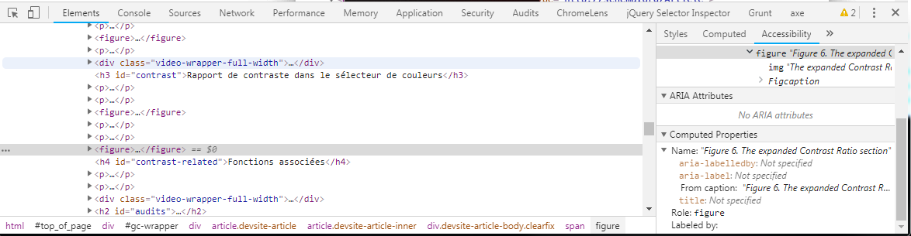

  
## Introduction

The name of the interface components also called accessible name, is basically the name who will be exposed to assistive technology <abbr>AT</abbr> via the accessibility <abbr>API</abbr>. This name is calculated by the browser via an algorithm called [Accessible Name and Description Computation 1.1](https://www.w3.org/TR/accname-1.1/).
In fact, to make it simple, the browser will generate an accessible tree from the <abbr>DOM</abbr> (Document Object Model) in which a large majority of <abbr>HTML</abbr> elements (those with only a presentation purpose, eg `div` and` span` tags do not have utility) need a (accessible) name to be correctly identified by the <abbr>AT</abbr>.

The accessible name is derived from the content of a tag, attributes of this tag or an element associated with it.

## In practice, how does it work?

The accessible name is, for example, announced by a screen reader when focus is placed on that element. The element's role (link, graphic, button, etc.) is then added to define the accessibility name property. The accessible name can be derived from the element's visible or hidden content. Interactive elements or images containing information must have an accessible name. For more details on whether an element should or should not have an accessible name, see the <a href="https://www.w3.org/WAI/ARIA/apg/practices/names-and-descriptions/#accessiblenameguidancebyrole">ARIA Authoring Practices Guide (APG)</a>. The accessible name allows <abbr>AT</abbr> users to understand the function of the control (interactive element); therefore, it must be relevant to its purpose and objective.

To be concise, in <a href="https://www.w3.org/TR/html-aam-1.0/#accname-computation">HTML Accessibility API Mappings 1.0 - computation method</a>, there is a priority order for calculating the name of a specific <abbr>HTML</abbr> element, but roughly:

1 First, <code>aria-labelledby</code>

1 Then, <code>aria-label</code>

1 nd finally, the associated elements, for example: tag text for buttons, links, and table cells; <code>label</code> elements for form fields; <code>legend</code> elements for <code>fieldset</code> elements; and <code>caption</code> elements for tables.

### Access to the accessible name  via the browser

To access the (accessible) name, the easiest way is to use the tools of browsers.

In Chrome, in Chrome dev tools (<kbd>Ctrl</kbd> + <kbd>Shift</kbd> + <kbd>i</kbd>), inspect an element ("Elements" tab) and open the "Accessibility" panel instead of "Style" "(usually on the right). Access to the "Accessibility tree" and in "Computed properties" you have to the "Name", the accessible name of the item being inspected.

In FireFox, in dev tools (<kbd>Ctrl</kbd> + <kbd>Shift</kbd> + <kbd>i</kbd>), open the "Accessibility" tab (to display the "Options" of dev tools), inspect an element. You access the "Name", the accessible name of the inspected item.

### Content of a tag

`<a href="ducks.html">plastic ducks</a>`

Here, the name of the link is the content (text10) of it: "plastic ducks". A screen reader user to take focus on this item will hear: "plastic ducks link". For a voice command user, to click on this link, will say: "click plastic ducks link".

So an item of this type `<button type="submit"></button>` without a title, will not be accessible, because, of course, there is no accessible name and therefore no information of ​​its function!

Also, we can add the elements to give a name.

`<button type="submit">Buy </button>`
 
 This button will have an accessible name that is the content of the button: the textual title, "Buy" plus the "alt" of the image: "the plastic duck" therefore "Buy the plastic duck".

### Associated element

Moreover, for form elements, the accessible name is the `label` when it is programmatically associated with the element via the `for` attribute referencing the `id` of the field.

<pre> <code class="html">
&lt;label for="search"&lt;Search&gt;/label&gt;
&lt;input id="search" type="text"&gt;
</code> </pre>

With this code, the screen reader will say: "Search edit".

### With <abbr>ARIA</abbr> too!

<abbr>ARIA</abbr> will be able to help us naming a <abbr>HTML</abbr> element, using `aria-label` and` aria-labelledby`.

<pre> <code class="html">
&lt;button class="navbar-toggler" type="button" aria-label="Opening menu navigation" ... &gt;
&lt;span class="navbar-toggler-icon"&gt;&lt;/span&gt;
&lt;/button&gt;
</code> </pre>

This hamburger menu button has a name: "Opening menu navigation".
But we could also use `aria-labelledby` to reference another element of the page like name:

<pre> <code class="html">
&lt;input type="search" aria-labelledby="this"&gt;
&lt;button id="this"&gt;Search the site&lt;/button&gt;
</code> </pre>
When taking focus on the field, the screen reader announces "Search on the site edit".

More details on ["The attributes <abbr>ARIA</abbr> that can save you"](/en/articles/aria-attributes-that-can-save-you/).

## Sources

- <a href="https://www.w3.org/TR/accname-1.1/"> Accessible Name and Description Computation 1.1 </a> by the Accessible Rich Internet Applications Working Group
- <a href="https://developer.paciellogroup.com/blog/2017/04/what-is-an-accessible-name/"> What is an accessible name? </a> by Léonie Watson
- <a href="https://w3c.github.io/accname/#mapping_additional_nd_description">Accessible Name and Description Computation 1.2 Editorial Draft (en)</a>
- <a href="https://www.w3.org/TR/html-aam-1.0">HTML Accessibility API Mappings 1.0</a>
    
