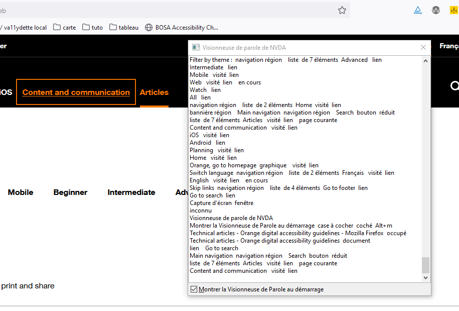
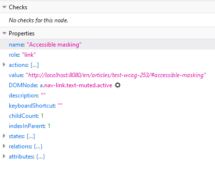
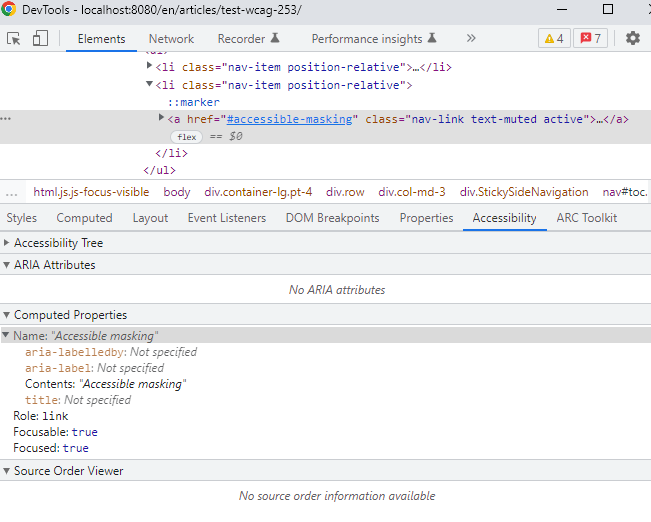

## Objective of the Criterion

**WCAG 2.5.3 – Label in Name** aims to ensure that when an interactive element (button, link, input field, etc.) displays visible text on the screen, that same text is also included in its **<a href="/src/fr/articles/le-nom-accessible-en-html.md">accessible name</a>**. 

This allows users of [assistive technologies](/src/fr/solutions-assistance.md) (particularly speech recognition software) to correctly understand and interact with the interface.
These tools rely on the **accessible name** to identify and activate elements.

The visible text does not need to be **strictly identical** to the accessible name, but it must **at minimum be included** within it — ideally at the **beginning**.

## Concrete Example

### Problematic

Consider a user navigating with speech recognition software who wants to fill out and submit a form.

<pre><code class="html">
&lt;button&gt;
    &lt;img src="send.png" alt="Submit"&gt;
&lt;/button&gt;
</code></pre>

In this example, the button visually displays the word **« Send »** (in the image), but the alternative text is **« Submit »**. The accessible name of the button therefore becomes *Submit*.

Result: a speech recognition user who says « Click Send » will not be able to activate the button, because the assistant will not recognize that name.

---

### Compliant Example

<pre><code class="html">
&lt;button&gt;
    &lt;img src="send.png" alt="Send"&gt;
&lt;/button&gt;
</code></pre>

The accessible name now contains the word **« Send »**, identical to the visible text. **WCAG 2.5.3 is therefore satisfied**.

---

## Be Careful with Visually Hidden Content

Hidden content should not be inserted **in the middle** of the visible label (it should be placed at the end instead), otherwise the criterion will fail and the element may not work properly with speech input.

### Example of an Error

<pre><code class="html">
&lt;a href="www.orange.com" target="_blank"&gt; Open &lt;span class="visually-hidden"&gt;in a new window &lt;/span&gt; the Orange website &lt;/a&gt;
</code></pre>

The accessible name becomes:

« Open in a new window the Orange website »

But the user only sees:

> « Open the Orange website »

With speech recognition, saying « Open the Orange website » **will not work**, because this text does not match the actual accessible name.

---

## How to Test Compliance

### 1. Using a Screen Reader

The screen reader announces:

 * the element’s **role** (button, link, text, etc.),
 * its **state**,
 * and its **accessible name**.

**Procedure:**

1. Navigate the page using a screen reader.
2. Listen to the name announced for each button or link.
3. If this name **does not match** the visible text, the criterion **is not satisfied**.

Some screen readers provide a *speech viewer* that displays the accessible name in text form, making comparison with the visible label easier.

---

### 2. Using Developer Tools

The method for verifying the criterion with browser developer tools depends on the browser used.

#### In Firefox

1. Open Developer Tools: `Ctrl + Shift + I`
2. Select the **Accessibility tab**
3. Inspect the element to verify
4. In the **Properties** section, check that the **name** attribute contains at least the visible on-screen text
 
 ---

#### In Chrome or Edge (Chromium)

1. Open Developer Tools: `Ctrl + Shift + I`
2. Select the **Elements tab**
3. Choose the element to inspect
4. Click the **Accessibility** tab (it may be hidden under « More tabs »)
5. In the **Computed Properties** section, verify that the **name** attribute contains at least the displayed text

---

## Summary

To comply with **WCAG 2.5.3**, make sure that:

* The visible text of an element is included in its accessible name, preferably at the beginning.
* Hidden content does not alter the correspondence between visible text and accessible name.
* Testing is performed using a screen reader **and/or** an accessibility inspector.

---

**Related Resources:**

* [WCAG 2.5.3 – Name in Label (W3C)](https://www.w3.org/TR/WCAG22/#label-in-name)
* [Guide Accessibilité – RGAA](https://accessibilite.numerique.gouv.fr/)