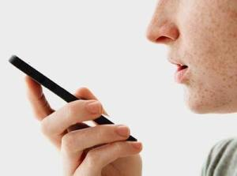

# Assistive technologies

People with disabilities can use assistive technologies to access the web whatever the device. These technologies include:
- Software solutions, such as screen reader or digital screen magnifiers,
- Equipment : ergonomic mice, keyboards with large keys, microphones, trackballs, Braille display, etc.

Digital services are accessible when they work with assistive technologies. It is important to highlight these technologies work only when web sites, mobile applications and digital content are created according to design and development accessibility rules (see dedicated tabs of this website for more information).

## Some examples and definitions
### Screen reader

A **screen reader** is a software application that allows blind or visually impaired people to read the information displayed on the screen with a speech synthesizer or braille display.  
Examples: Jaws and NVDA on Windows PC, TalkBack on Android devices, VoiceOver on Apple mobile devices or Mac computers.

### Braille display
A **Braille display** allows reading digital information using fingers. It can be connected to a computer or any other device.  The Braille display get the text currently highlighted on the screen and then the screen reader translates the text in Braille and the device displays it on its Braille cells. Each cell has metal or nylon pins to create Braille dots. Braille displays are refreshable.

<figure>
    
    <figcaption>Picture: Braille display, Karola Riegler, 2009, License CC BY ND</figcaption>
</figure>

### Screen magnifier

A **screen magnifier** is a software application that increases the size of texts and graphics on device screen. Screen magnifiers can also provide features to customize color contrasts, brightness, cursor…  
Some screen readers offer option to read aloud captured text or all screen.  
Example: ZoomText.

<figure>
    
    <figcaption>Picture: computer screen with Windows magnifier at 400% magnification.</figcaption>
</figure>

### Keyboard keyguard

A **keyguard** is an overlay made of plastic and perforated with holes for keys on the keyboard. It is placed on top of the keyboard. It helps prevent the user from unintentionally pressing multiple keys.

<figure>
    
    <figcaption>Picture: keyguard copyplastic.com</figcaption>
</figure>

### Pointing devices

Pointing devices are any device used to control the movement of a cursor on a computer screen (or tablet or mobile). For people who lack the coordination to use a standard mouse or keyboard, there are many alternatives:
- **Joysticks** (or joystick mouse) consist of a stick that pivots on a base. They allow controlling the cursor by shifting the stick. 
- **Trackballs** are equipped with a ball that moves the cursor by rolling it.
- **Switches** or contactors are buttons that have two states – on and off -. Switches have different activation methods according to the body part that can be controlled: eyes, mouth, head, foot, voice etc.  

Most of these pointing devices rely on keyboard-only navigation features to perform mouse/pointer functions.   

### Keyboard-only navigation
**Keyboard navigation** refers to using keys instead of a mouse to move from item to item on the screen. The movement must be in a meaningful order, order specified by the operating system or the application. The focus (the place where the cursor is located) must be visible. 
Typical keys used for keyboard navigation are the Tab key and Shift+Tab to move between controls, as well as arrow keys to move up, down, and sideways between items.
Keyboard navigation is essential for some assistive technologies and requires compliance with design and development accessibility criteria.

### Speech recognition
**Speech recognition** is the ability of software to identify words and phrases in spoken language and convert them into text. It is an alternative to typing on a keyboard: you talk to the computer and the words appear on the screen.  

Equivalent term: voice recognition.  
Examples: Dragon dictation software, voice assistants of smartphones.
<figure>
    
    <figcaption>Photo: Alex Washburn / Wired / Creative Commons License</figcaption>
</figure>

### Transcript
A **transcript** is the text version of video or audio recordings. The transcript is presented in a digital document (Word, PDF, HTML...).

### Closed captions
**Closed captions** are audio transcribed into text and reflect both spoken words and non-verbal sounds. The text is synchronized within the video to match the audio. Closed captions are usually located on the bottom of a video screen as an overlay.

    

### Audio description
**Audio description** is a narration added to the soundtrack to describe important visual details that cannot be understood from the main soundtrack alone.  Audio description is a means to inform individuals about visual content essential for comprehension.  Audio description of video provides information about actions, characters…  

Equivalent terms: video description, descriptive narration.
