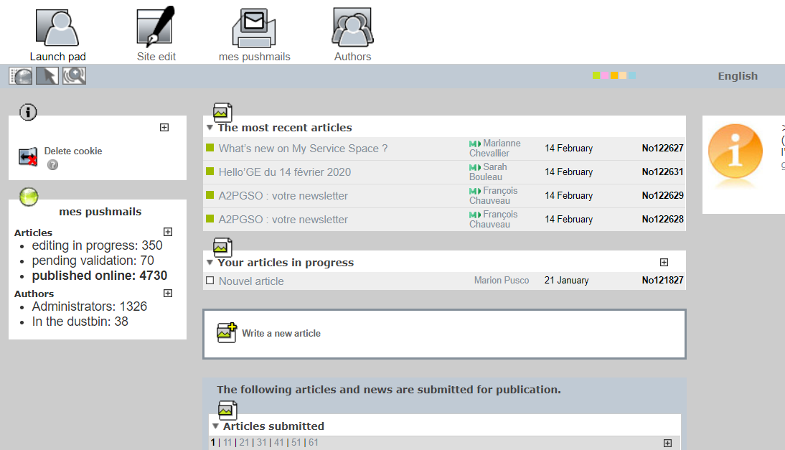

# Emails accessibility

Here, a list of guidelines/best practices for writing messages that everyone can understand whether or not the recipient usesis using assistive technology.

## What can be problematic?
- Images
- Fonts, colors and styles used
- Layout tables
- Links

## Important

If your communication contains a lot of information and its layout needs to be complex:
- create the email with the method which is the easiest for you,
- add [an accessible Word file](./word-create.html) (or text file) as an attachment containing the same level of information (but only in text!),
- specify that the equivalent accessible text is contained in the attachment.

## "Everyday" emails
For all your everyday emails:
- Use simple, sans serif fonts: Arial, Calibri or [Accessible DfA](http://c-rnt.apf.asso.fr/2019/01/07/accessible-dfa-une-police-open-source-concue-par-orange/)
- Adopt a font size at least equal to 10 points
- Put a capital letter at the beginning of each sentence but avoid whole sentences in capital letters
- Align the texts to the left (avoid justifying)
- Avoid too many italic or bold chunks of text or phrases
- Check the contrast between the font color and the background (Colour Contrast Analyzer) and limit the total number of colors used
- Use a neutral background: no decorative paper letter or background images
- Enter an alternative text for all the images (Office: right click on the picture> Format Picture > Alt text> "Description" field) or if the image is just descriptive, leave the "Description" field empty
- Use the "Title" and "Subtitle" styles of the "text format" menu if long mail, with several sections
- Add an emoticon alternative text, example: ";) [wink smiley] " instead of just ";)"
- Avoid animations, animated GIFs and luminosity flashes
- Write explicit link labels, for example: prefer "discover our offers" to "click here" or "find out more"
- Use the "Withdrawal, Spacing" functions to skip lines, example Office suite: Page Layout menu> Paragraph> Indent or Spacing or Right click on your text: "Paragraph ...")
- Check that the size of the buttons and clickable areas is sufficient : no smaller than 1cm (0.4")
- Configure your mail tool: HTML format by default, Outlook for example: File> Options> Mail> Compose messages

## Pushmails
You have several options for creating an accessible Pushmail.

## From a Word document
1. Create a Word document accessible by following [the Word recommendations](word-create.html).
2. Then use the "Send to Mail Recipient"* option.
*Add this Option the first time via File> Options> Quick access toolbar> “Send to Mail Recipient”

## From "My Pushmails" (SPIP)
The tool provides natively accessible templates (don’t forget alternative text for the images) which does not prevent you from following [the general recommendations for editorial content](editorial.html).

## Creation from HTML (or other dedicated tool)
Compose the HTML code in an accessible way by following [the main web recommendations](../web_EN/index.html).  

Important: there are multiple email clients so there can be interpretation issues, the layout should rather be done via tables (using role=presentation in the &lt;table&gt; tag).

## Links
- [Improve email accessibility ](https://support.office.com/en-us/article/video-improve-email-accessibility-ebf3730a-18f8-4b57-81d1-730086231775?omkt=en-001&ui=en-US&rs=en-001&ad=US)
- [A Beginner’s Guide to Email Accessibility](https://webdesign.tutsplus.com/tutorials/a-beginners-guide-to-email-accessibility--cms-31240)
- [The Ultimate Guide to Accessible Emails](https://litmus.com/blog/ultimate-guide-accessible-emails)
- [Ideal Mobile Touchscreen Target Sizes](https://www.smashingmagazine.com/2012/02/finger-friendly-design-ideal-mobile-touchscreen-target-sizes/)
