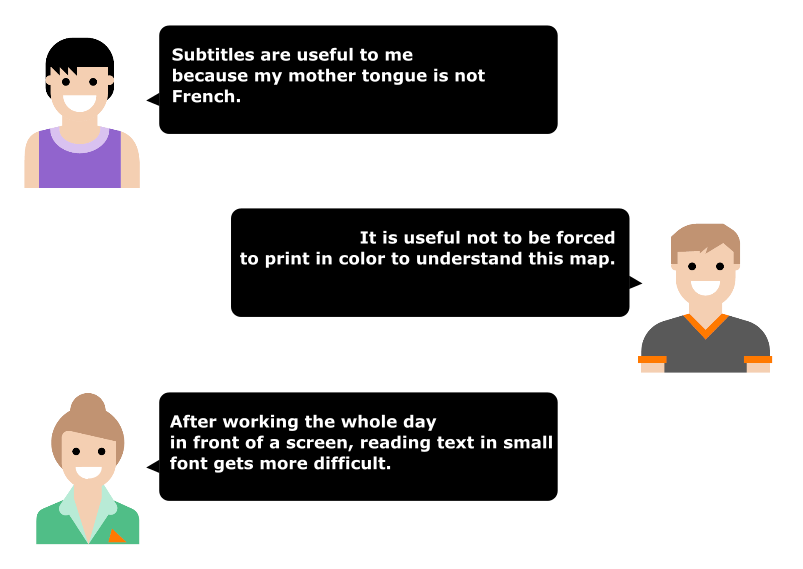

# Orange digital accessibility guidelines

<h2 id="what-is-digital-accessibility" class="page-title">What is digital accessibility?</h2>

Digital accessibility is about making the access to digital information possible regardless of the nature of a person’s disability and how they consult the information. It involves different technologies such as the Web, videos, Word and PDF documents, but also digital television or mobile phones. 

It is not a question of increasing the number of information outlets, but of respecting functional, graphical, technical and editorial rules that will enable everyone to access information no matter what tools they use.

## Who is concerned by digital accessibility?

Being disabled is not limited to what other people can see.
Also, it is not necessarily a permanent situation and it can happen to any of us at some point in our life.

&nbsp;  

    The following quotes are a great example of that:
    <ul>
        <li>The subtitles are useful to me because my mother tongue is not French,</li>
        <li>It is useful not to be forced to print in colour to understand this map,</li>
        <li>After working the whole day in front of a screen, reading text in small fonts gets more difficult.</li>
    </ul>

