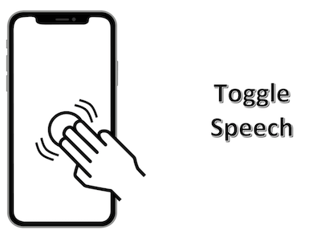
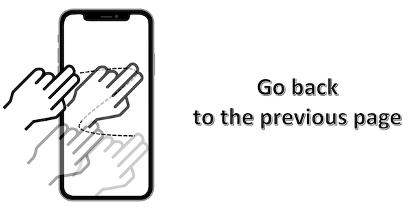

# VoiceOver user guide

VoiceOver is a built-in screen reader that reads aloud the items that appear on the device screen.
 It vocalizes all visible elements in the page specially for blind or impaired, dyslexic or illiterate users.

VoiceOver can be switched on thanks to the `Settings` device menu:

<ul class="nav nav-tabs" role="tablist">
    <li class="nav-item" role="presentation">
        <a class="nav-link active"
           data-toggle="tab" 
           href="#VoiceOverActivation-iOS13"
           role="tab" 
           aria-selected="true">iOS 13</a>
    </li>
    <li class="nav-item" role="presentation">
        <a class="nav-link" 
           data-toggle="tab" 
           href="#VoiceOverActivation-iOS12"
           role="tab" 
           aria-selected="false">iOS 12</a>
    </li>
</ul>

    

     

 When VoiceOver is on, the standard gestures behave differently and additional gestures let you move the focus on the screen and control the selected items. 

It's better but not mandatory to **activate the vibration** feature in the accessibility settings in order to feel the trigger of some actions.

<ul class="nav nav-tabs" role="tablist">
    <li class="nav-item" role="presentation">
        <a class="nav-link active"
           data-toggle="tab" 
           href="#iPhoneVibration-iOS13"
           role="tab" 
           aria-selected="true">iOS 13</a>
    </li>
    <li class="nav-item" role="presentation">
        <a class="nav-link" 
           data-toggle="tab" 
           href="#iPhoneVibration-iOS12"
           role="tab" 
           aria-selected="false">iOS 12</a>
    </li>
</ul>

    

     

 A sound may be heard in case of a disactivated vibration feature but VoiceOver might cover it.

Two gestures are important to be well understood so as to perfectly harness the provided details thereafter:

The **flick** consists in raising the finger of the screen at the end of the mopvement while continuing it in the air.

The **swipe** consists in doing the gesture while keeping the finger on the screen.

First, VoiceOver common gestures will be introduced to be followed by iPhoneX dedicated gestures.
 The last part will deal with unusual but useful features for an advanced user.

  
## Common gestures
<ul class="list-gesture">
  <li class="clearfix">
    
  
<h3>Drag one finger</h3>

Explore your screen and hear audible feedback for what is being touched.

  </li>  
  <li class="clearfix">
    
    
<h3>Double-tap anywhere on the screen</h3>

Opens or activates the item that you last touched (vocalized).

  </li>  
    <li class="clearfix">

<h3>Flick up or down using three fingers</h3>

Scroll within lists or pages if selected. Equivalent to a vertical swipe.
  
  </li> 
  <li class="clearfix">

 
<h3>Flick left or right using three fingers</h3>

Change pages and screens when possible. Equivalent to a horizontal swipe.

  </li> 
  <li class="clearfix">  

   
<h3>Flick left/right using one finger</h3>

Move the focus to the previous/next item.

  </li> 
  <li class="clearfix"> 

 
<h3>Flick up/down using one finger</h3>

Increase/decrease the value of an adjustable element.

  </li>
</ul>

  
## iPhoneX
The lack of the home button on the main screen for this device has modified the usual gestures.
 These [new common gestures](iphone-x/) have induced new VoiceOver behavior for some actions:

- [Go to Home Screen.](#BackHome)

- [Get Multitask Pane.](#Multitask)

- [Open Control Center.](#ControlCenter)

- [See Notifications.](#NotificationCenter)

 Gesture: **flick up with one finger** from the bottom edge of the screen until you feel a **simple vibration** (approximately the **first lower quarter part of the screen**).

  Gesture: **flick up with one finger** from the bottom edge of the screen until you feel a **double vibration** (approximately **in the middle of the screen**).

 Gesture: **flick down with one finger** from the top edge of the screen until you feel a **simple vibration** (approximately the **first upper quarter part of the screen**).

 Gesture: **flick down with one finger** from the top edge of the screen until you feel a **double vibration** (approximately **in the middle of the screen**).

  
## Tips & Tricks
Hereunder are unusual features that may be useful to a VoiceOver user on **any type of device**:

- [Read elements from the top.](#ReadAllElementsFromTop)

- [Read elements from the selection.](#ReadAllElementsFromSelection)

- [Start/pause the elements vocalization.](#ToggleAutomaticReading)

- [Locate the selected element.](#LocateSelectedElement)

- [Toggle Speech.](#ToggleSpeech)

- [Open Control Center.](#ControlCenterBis)

- [See Notifications.](#NotificationCenterBis)

- [Activate the selected element.](#ElementActivation)

- [Go back to the previous page.](#Scrub)

- [Use the item chooser list.](#ItemChooserList)

- [Select the first element on the page.](#PageFirstElement)

- [Select the last element on the page.](#PageLastElement)

- [Toggle Curtain Screen.](#CurtainScreen)

- [Set a custom label.](#CustomLabel)

- [Use Spotlight Search.](#SpotlightSearch)

- [Activate a long pressure.](#LongPressure)

- [Open a link in a text view.](#OpenLink)

 Gesture: **flick up with 2 fingers** anywhere on the screen.

 Gesture: **flick down with 2 fingers** anywhere on the screen.

 

 Gesture: **simple-tap with 2 fingers** anywhere on the screen.

 Gesture: **simple-tap with 3 fingers** anywhere on the screen.

 Gesture: **double-tap with 3 fingers** anywhere on the screen.
 If the `zoom` functionality is activated in the settings, a **triple-tap** will be mandatory to obtain the same result.

 First of all, **an element of the status bar must be selected**.
 Gesture: **flick up with 3 fingers** anywhere on the screen.

 First of all, **an element of the status bar must be selected**.
 Gesture: **flick down with 3 fingers** anywhere on the screen.

 Gesture: **select and hold** the element with **one finger**, then make a **simple-tap with another finger** anywhere on the screen.
 This is a very useful gesture when using a keyboard : the index finger select the letter while the middle finger makes the simple-tap.

 Gesture: **swipe with 2 fingers** drawing a **Z-shape** anywhere on the screen.
 This ends exactly in the same result as the click on the native back button.

 Gesture: **triple-tap with 2 fingers** anywhere on the screen.

 Gesture: **simple-tap with 4 fingers** in the upper half part of the screen.

 Gesture: **simple-tap with 4 fingers** in the lower half part of the screen.

 Gesture: **triple-tap with 3 fingers** anywhere on the screen.
 If the `zoom` functionality is activated in the settings, a **quadruple-tap** will be mandatory to obtain the same result.
 It will allow a VoiceOver using with a dark screen promoting the confidentiality and the longevity of the battery at the same time.

 Gesture: **double-tap and hold with 2 fingers** anywhere on the screen.

 Gesture: **flick down with 3 fingers** anywhere on the screen.

 Gesture: **double-tap and hold with 1 finger** (iOS 12) or **triple-tap with 1 finger** (iOS 13) anywhere on the screen.

 Gesture: **double-tap and hold with 1 finger** anywhere on the screen.
 First, select the 'Links' rotor item before flicking up to reach the desired link.
 Then, double-tap and hold with one finger once the link is selected **until a popup shows up and an action sheet appears** to suggest the appropriate option.

