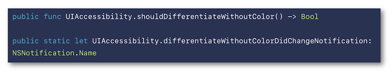
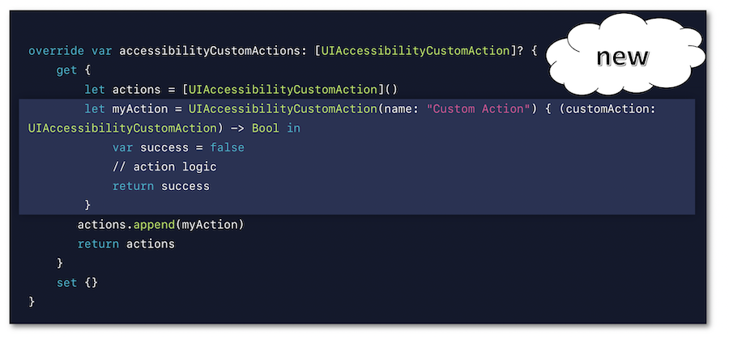

# WWDC 2019 : Accessibility Lessons

 This video encompasses four short presentations all available on the **official Apple website**:

- [Visual Design Accessibility](#VisualDesignAccessibility)
- [Accessibility Inspector](#AccessibilityInspector)
- [Writing Great Accessibility Labels](#WritingGreatAccessibilityLabels)
- [Accessibility Custom Actions](#AccessibilityCustomActions)

Thereafter, according to the presentation configuration, the selection of a title or a timelapse will give rise to the video playback on the Apple website directly at the proper moment.
  

## Visual Design Accessibility
This video available on the **official Apple website** ([session 244](https://developer.apple.com/videos/play/wwdc2019/244/)) highlights some points to **provide a better accessible application visually speaking**.
 
  Various contents are indicated hereunder:

- **DYNAMIC TYPE**
    - <a role="button" onclick="$('#DynamicType-TheFourPrinciples_tab').trigger('click');document.getElementById('DynamicType').scrollIntoView({ behavior: 'smooth', block: 'start' })">The Four Principles</a>
    - <a role="button" onclick="$('#DynamicType-TextStyles_tab').trigger('click');document.getElementById('DynamicType').scrollIntoView({ behavior: 'smooth', block: 'start' })">Text Styles</a>
    - <a role="button" onclick="$('#DynamicType-Xcode_tab').trigger('click');document.getElementById('DynamicType').scrollIntoView({ behavior: 'smooth', block: 'start' })">Xcode</a> ⟹ **iOS 13 new feature**
  
- **REDUCE MOTION**
    - <a role="button" onclick="$('#ReduceMotion-TheBasics_tab').trigger('click');document.getElementById('ReduceMotion').scrollIntoView({ behavior: 'smooth', block: 'start' })">The Basics</a>
    - <a role="button" onclick="$('#ReduceMotion-AutoplayingVideo_tab').trigger('click');document.getElementById('ReduceMotion').scrollIntoView({ behavior: 'smooth', block: 'start' })">Autoplaying Video</a> ⟹ **iOS 13 new feature**
    - <a role="button" onclick="$('#ReduceMotion-ScreenTransitions_tab').trigger('click');document.getElementById('ReduceMotion').scrollIntoView({ behavior: 'smooth', block: 'start' })">Screen Transitions</a> ⟹ **iOS 13 new feature**
  
- **COLOR**
    - <a role="button" onclick="$('#Color-TheBasics_tab').trigger('click');document.getElementById('Color').scrollIntoView({ behavior: 'smooth', block: 'start' })">The Basics</a>
    - <a role="button" onclick="$('#Color-DifferentiateWithoutColor_tab').trigger('click');document.getElementById('Color').scrollIntoView({ behavior: 'smooth', block: 'start' })">Differentiate Without Color</a> ⟹ **iOS 13 new feature**
 

### DYNAMIC TYPE
<ul class="nav nav-tabs" role="tablist">
    <li class="nav-item">
        <a class="nav-link active"
           data-toggle="tab" 
           href="#DynamicType-TheFourPrinciples"
           id="DynamicType-TheFourPrinciples_tab"
           role="tab" 
           aria-selected="true">The Four Principles</a>
    </li>
    <li class="nav-item">
        <a class="nav-link" 
           data-toggle="tab" 
           href="#DynamicType-TextStyles"
           id="DynamicType-TextStyles_tab"
           role="tab" 
           aria-selected="false">Text Styles</a>
    </li>
    <li class="nav-item">
        <a class="nav-link" 
           data-toggle="tab" 
           href="#DynamicType-Xcode"
           id="DynamicType-Xcode_tab"
           role="tab" 
           aria-selected="false">Xcode</a>
    </li>
</ul>

     
<a alt="Click to playback the video at the indicated time." href="https://developer.apple.com/videos/play/wwdc2019/244/?time=77">🎬 (01:17)</a>
  
The use of `Dynamic Type` is based on four principles that are highly recommended to be followed: 
 
<ul>
  <li>If the text can be dynamic, it must be implemented to reach this purpose.</li>
  <li>Use as much of the screen width as possible.</li>
  <li>Don't truncate text as it grows if it's not the case in the default user interface.</li>
  <li>Scale the glyphs next to text to make the interface look balanced. </li>
</ul>

<a alt="Click to playback the video at the indicated time." href="https://developer.apple.com/videos/play/wwdc2019/244/?time=110">🎬 (01:50)</a>
  
Reminder of the 11 text styles available since iOS 11:
 
 ... and the programmatic way of their implementations:
 
 A more detailed explanation of the `Dynamic Type` implementation is available in the <a href="../../development#text-size" style="text-decoration: underline;">developers guide section</a>.

<a alt="Click to playback the video at the indicated time." href="https://developer.apple.com/videos/play/wwdc2019/244/?time=180">🎬 (03:00)</a>
  
A **new pane** is available with **Xcode 11** to vary the text size and to dynamically visualize its rendering on the simulator.
 

 

### REDUCE MOTION
<ul class="nav nav-tabs" role="tablist">
    <li class="nav-item">
        <a class="nav-link active"
           data-toggle="tab" 
           href="#ReduceMotion-TheBasics"
           id="ReduceMotion-TheBasics_tab"
           role="tab" 
           aria-selected="true">The Basics</a>
    </li>
    <li class="nav-item">
        <a class="nav-link" 
           data-toggle="tab" 
           href="#ReduceMotion-AutoplayingVideo"
           id="ReduceMotion-AutoplayingVideo_tab"
           role="tab" 
           aria-selected="false">Autoplaying Video</a>
    </li>
    <li class="nav-item">
        <a class="nav-link" 
           data-toggle="tab" 
           href="#ReduceMotion-ScreenTransitions"
           id="ReduceMotion-ScreenTransitions_tab"
           role="tab" 
           aria-selected="false">Screen Transitions</a>
    </li>
</ul>

<a alt="Click to playback the video at the indicated time." href="https://developer.apple.com/videos/play/wwdc2019/244/?time=203">🎬 (03:23)</a>
  

Reminder of the current situation already including this functionality to reduce motion on screen:
 
 ... and of the programmatic way to be aware of its value from the device settings:
 
 A detailed explanation of the accessibility options states and events is available in the <a href="../../development#accessibility-options" style="text-decoration: underline;">developers guide section</a>.

<a alt="Click to playback the video at the indicated time." href="https://developer.apple.com/videos/play/wwdc2019/244/?time=257">🎬 (04:17)</a>
  

The video automatic preview playing is now in the hands of the user who can decide its de/activation thanks to the device settings as an **iOS 13 new feature**:
 
 It's also possible to be aware of this option state following a programmatic way:
 
 If this option is deactivated, the video control must be regained only under the user interaction.

<a alt="Click to playback the video at the indicated time." href="https://developer.apple.com/videos/play/wwdc2019/244/?time=343">🎬 (05:43)</a>
  

This **iOS 13 new feature** only appears once the `Reduce Motion` accessibility option is activated.
 Its purpose is to lower the transition visual effect between screens that may impact some users having a visual motion painful sensitivity.
 
 Once activated, the `Prefer Cross-Fade Transitions` option is automatically taken into account by all the UIKit standard elements *(navigation, modal views...)*.

 

### COLOR
<ul class="nav nav-tabs" role="tablist">
    <li class="nav-item">
        <a class="nav-link active"
           data-toggle="tab" 
           href="#Color-TheBasics"
           id="Color-TheBasics_tab"
           role="tab" 
           aria-selected="true">The Basics</a>
    </li>
    <li class="nav-item">
        <a class="nav-link" 
           data-toggle="tab" 
           href="#Color-DifferentiateWithoutColor"
           id="Color-DifferentiateWithoutColor_tab"
           role="tab" 
           aria-selected="false">Differentiate Without Color</a>
    </li>
</ul>

<a alt="Click to playback the video at the indicated time." href="https://developer.apple.com/videos/play/wwdc2019/244/?time=400">🎬 (06:40)</a>
  

Introduction of dyschromatopsia whose understanding will naturally lead towards the new functionality exposed in the next sheet.
 

<a alt="Click to playback the video at the indicated time." href="https://developer.apple.com/videos/play/wwdc2019/244/?time=453">🎬 (07:33)</a>
  

The `Differentiate Without Color` **iOS 13 new feature** is a user setting that indicates the will of having **visual information not passed on by colors**.
 
 There's also a programmatic way to be aware of its value so as to subsequently adapt the user interface:
 
 Admittedly, it's highly recommended <a href="./criteria-ios.html#colours" style="text-decoration: underline;">never to transmit information by colors</a> but this situation may be critical for some use cases that must adapt their configuration accordingly *(video games for instance)*.
  

   

## Accessibility Inspector
This video available on the **official Apple website** ([session 257](https://developer.apple.com/videos/play/wwdc2019/257/)) aims at introducing the Accessibility Inspector tool and some Xcode 11 new features that will solve problems exposed inside a demo application.
 
  Various contents and their video timelapse are indicated hereunder:

- [Introduction](#Introduction) (00:51)
- [Audit](#Audit) (02:26)
- [Inspection](#Inspection) (03:40) including a **Xcode 11 new feature**
- [CATextLayer](#CATextLayer) (05:26)
- [Color Contrast](#ColorContrast) (06:26) including a **Xcode 11 new feature**
- [Conclusion](#Conclusion) (08:24)
  

### [Introduction (00:51)](https://developer.apple.com/videos/play/wwdc2019/257/?time=51)

 The demo application is introduced in depth so as to have a better understanding of some further issues while highlighting:

- The way to open Accessibility Inspector [(01:34)](https://developer.apple.com/videos/play/wwdc2019/257/?time=94).
- The `hover text` mac feature [(01:43)](https://developer.apple.com/videos/play/wwdc2019/257/?time=103).
  

### [Audit (02:26)](https://developer.apple.com/videos/play/wwdc2019/257/?time=146)
The purpose of this functionality is to provide a list of potential accessibility issues.
 
   

### [Inspection (03:40)](https://developer.apple.com/videos/play/wwdc2019/257/?time=220)
Introduction of a **Xcode 11 new feature** to **vocalize and select elements on the simulator** [(04:11)](https://developer.apple.com/videos/play/wwdc2019/257/?time=251) after showing the way to get the complete description of a graphic element in conjunction with its selection.
 
   

### [CATextLayer (05:26)](https://developer.apple.com/videos/play/wwdc2019/257/?time=326)
This example emphasizes the non automatic accessibility handling for this kind of element that must be programmatically implemented to behave like any other accessibility element.
   

### [Color Contrast (06:26)](https://developer.apple.com/videos/play/wwdc2019/257/?time=386)
Besides the font size, it's also very important to be above a [contrast ratio](./criteria-ios.html#colours) to enable sight-impaired people to perfectly understand the whole screen content.
 Once the color contrast issue is detected, a solution is brought about by the **Xcode 11 new feature**: **Color Contrast Calculator**.
 
   

### [Conclusion (08:24)](https://developer.apple.com/videos/play/wwdc2019/257/?time=504)
All the previous tools that have been used during this session are highlighted in order to visualize the final rendering and to be sure that the suggested solutions are effective.
   

## Writing Great Accessibility Labels
This video available on the **official Apple website** ([session 254](https://developer.apple.com/videos/play/wwdc2019/254/)) is entirely presented by a blind person who explains the importance and the way of writing labels to be perfectly understood whatever the context.
 Many examples are provided to show how the visual elements are exposed to a VoiceOver user when its properties are well fulfilled... or not.
 
  

After a quick introduction regarding the expectations of a blind user about a **mobile application at first launch** [(00:13)](https://developer.apple.com/videos/play/wwdc2019/254/?time=13), the **label definition** is introduced in details [(01:53)](https://developer.apple.com/videos/play/wwdc2019/254/?time=113) followed by clear **explanations of different contexts** a button example belongs to in order to adapt its label accordingly [(02:41)](https://developer.apple.com/videos/play/wwdc2019/254/?time=161).
  Finally, the following best practices are presented with illustrative examples: [(04:24)](https://developer.apple.com/videos/play/wwdc2019/254/?time=264)

- Always add appropriate labels to the accessibility elements [(04:33)](https://developer.apple.com/videos/play/wwdc2019/254/?time=273).
- Don't include the element type in the label [(05:22)](https://developer.apple.com/videos/play/wwdc2019/254/?time=322).
- Update labels when the user interface changes [(05:46)](https://developer.apple.com/videos/play/wwdc2019/254/?time=346).
- Provide a context clarification when necessary [(06:07)](https://developer.apple.com/videos/play/wwdc2019/254/?time=367).
- Avoid redundancy when things are clear according to the context [(06:42)](https://developer.apple.com/videos/play/wwdc2019/254/?time=402).
- Add labels to the meaningful animations *(spinner...)* [(07:08)](https://developer.apple.com/videos/play/wwdc2019/254/?time=428).
- Avoid verbose labels when not necessary [(07:24)](https://developer.apple.com/videos/play/wwdc2019/254/?time=444) but don't hesitate to use it when appropriate [(07:48)](https://developer.apple.com/videos/play/wwdc2019/254/?time=468).
   

## Accessibility Custom Actions
This video available on the **official Apple website** ([session 250](https://developer.apple.com/videos/play/wwdc2019/250/)) highlights the custom actions for the [screen reader](./voiceover.html) and the [Switch Control feature](../../development#switch-control) thanks to a demo application that presents the explained concepts.
 
  Various contents and their video timelapse are indicated hereunder:

- [Introduction](#CustomActionsIntroduction) (00:12)
- <a role="button" onclick="$('#CustomActions-VoiceOver_tab').trigger('click');document.getElementById('CustomActions').scrollIntoView({ behavior: 'smooth', block: 'start' })">Custom Actions: VoiceOver</a> (03:10)
- <a role="button" onclick="$('#CustomActions-SwitchControl_tab').trigger('click');document.getElementById('CustomActions').scrollIntoView({ behavior: 'smooth', block: 'start' })">Custom Actions: Switch Control</a> (04:28)
- [Implementation](#CustomActionsCoding) (07:59) ⟹ **iOS 13 new syntax**
   

## [Introduction (00:12)](https://developer.apple.com/videos/play/wwdc2019/250/?time=12)
Quick introduction of VoiceOver with a problem due to an inadequate implementation highlighted by the demo application that's used all along the session.
   

## Custom Actions
<ul class="nav nav-tabs" role="tablist">
    <li class="nav-item">
        <a class="nav-link active"
           data-toggle="tab" 
           href="#CustomActions-VoiceOver"
           id="CustomActions-VoiceOver_tab"
           role="tab" 
           aria-selected="true">VoiceOver</a>
    </li>
    <li class="nav-item">
        <a class="nav-link" 
           data-toggle="tab" 
           href="#CustomActions-SwitchControl"
           id="CustomActions-SwitchControl_tab"
           role="tab" 
           aria-selected="false">Switch Control</a>
    </li>
</ul>

<a alt="Click to playback the video at the indicated time." href="https://developer.apple.com/videos/play/wwdc2019/250/?time=190">🎬 (03:10)</a>
  
The purpose of the <a href="../../development#custom-actions" style="text-decoration: underline;">custom actions</a>  with VoiceOver is clearly explained which helps understand why and in which contexts this functionality must be implemented to significantly improve the user experience.

<a alt="Click to playback the video at the indicated time." href="https://developer.apple.com/videos/play/wwdc2019/250/?time=268">🎬 (04:28)</a>
  
The demo application uses the Switch Control feature on the device that is paired with two switches: the first one *(orange)* aims at moving the focus to the next item while the second one *(white)* aims at activating the focused item.
 
 Implementing custom actions in this context leads to a **drastic decrease of focus/activations actions** to be carried out by the user so as to reach the same result.

   

## [Implementation (07:59)](https://developer.apple.com/videos/play/wwdc2019/250/?time=479)
Since iOS 8, the [custom actions](../../development#custom-actions) implementation relies on an Objective C syntax that now fits a Swift form by introducing a **closure** in **iOS 13**.
 
   
