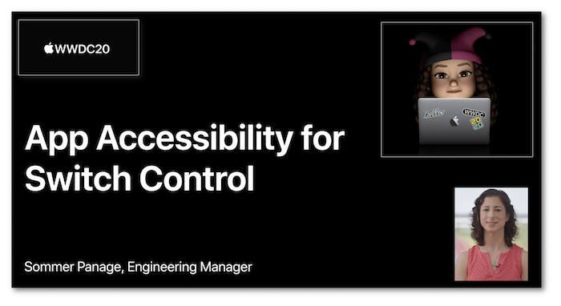
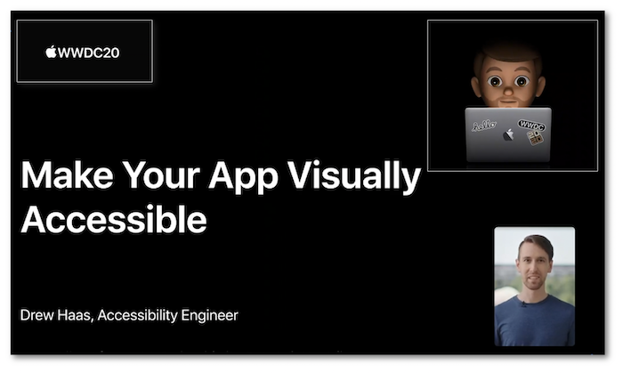
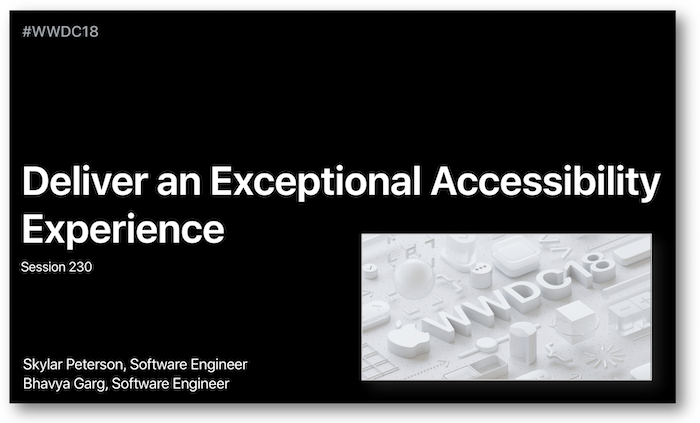
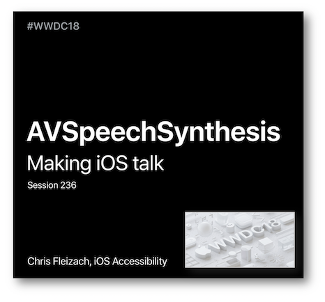
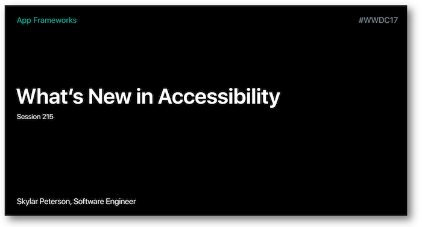
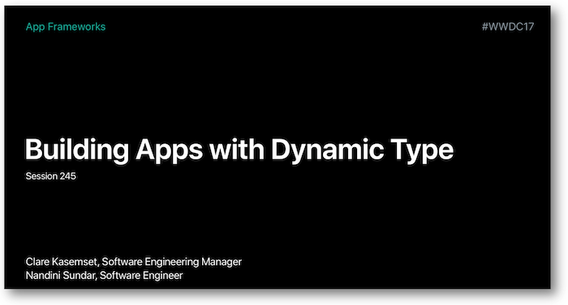
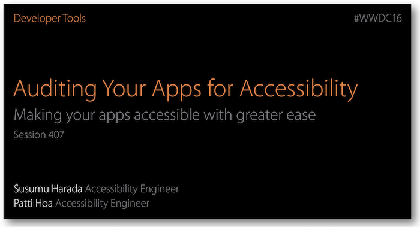

# WWDC : World Wide Developers Conference

This section regroups [presentations at the WWDC](https://developer.apple.com/videos/) dealing with accessibility.

Each one of them is detailed with time references to their different contents.

Most of the illustrations are parts of Apple presentations and are available at the `Resources` section inside the `Overview` sheet of each video.

**The summary of each video can be reached on clicking the title or the image presentation**.
   

## [2020 - VoiceOver Efficiency with Custom Rotors](2020/116/)
Explanations about **custom rotors** are enlighted thanks to an application for which the rotor functionalities implementations are detailed in depth.
<a href="2020/116/">
    

   

## [2020 - App Accessibility for Switch Control](2020/019/)
Many **improvements for the user experience** dealing with the **Switch Control feature** are listed and perfectly explained in this video session.
<a href="2020/019/">
    

   

## [2020 - Make Your App Visually Accessible](2020/020/)
This footage highlights a bundle of criteria and methods to render an optimal accessible visual aspect to a mobile application.
<a href="2020/020/">
    

   

## [2019 - Large Content Viewer](2019/261/)
This video session deals with the **Large Content Viewer** feature that helps people who prefer and/or need larger text sizes.
<a href="2019/261/">
    

   

## [2019 - Accessibility lessons](2019/)
This video session encompasses four short presentations dealing with accessiblity.
<a href="2019/">
    

   

## [2018 - Deliver an exceptional accessibility experience](2018/230/)
This presentation is a detailed explanation of functionalities for visual impaired people leading to a very good user experience.

A demo application will highlight these functionalities purposes so as to understand the rationale behind their implementation.
<a href="2018/230/">
    

   
    
## [2018 - AVSpeechSynthesizer](2018/236/)
This short video introduces the essential elements to be implemented so as to make an iOS application talk.
<a href="2018/236/">
    

   

## [2017 - What's New in Accessibility](2017/215/)
Introduction of new iOS 11 accessibility features merging the user and the developer sides.
<a href="2017/215/">
    

   

## [2017 - Building Apps with Dynamic Type](2017/245/)
`Dynamic`&nbsp;`Type` highlights the iOS capacity to adapt the text size according to the user settings.

This video contains a theoretical approach to understand all the `Dynamic`&nbsp;`Type` possibilities as well as a practical part dealing with the developer side to avoid common pitfalls.
<a href="2017/245/">
    

   

## [2016 - What's New in Accessibility](2016/202/)
Introduction of new iOS, MacOS, tvOS and WatchOS accessibility features merging the user and the developer sides.
<a href="2016/202/">
    

   
    
## [2016 - Auditing Your Apps for Accessibility](2016/407)
This presentation is a detailed explanation of the `Accessibility Inspector` Xcode tool with a programatic VoiceOver introduction at the begining.
<a href="2016/407/">
    

