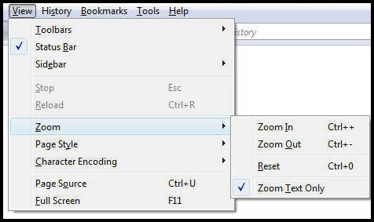
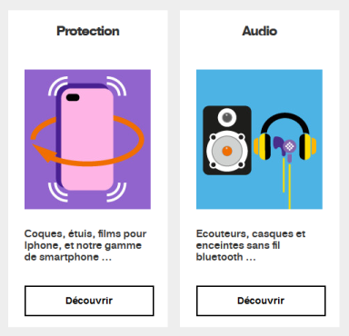
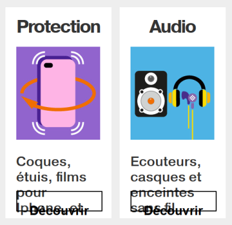

# Text size enlargement

## How to test?

One of the accessibility requirements is being able to enlarge the text up to 200% —only the text size, not the entire page. Actually when you use the browser default zoom it enlarges the entire page adding vertical and horizontal scrollbars. For example, reading a blog could be very tedious because you would have to scroll all the time to access the content.

Increasing only the text size does not necessarily add a horizontal scrollbar. You must verify that at this zoom level (200%), the text remains readable. No text must be truncated or superposed. Information must be accessible even if the presentation can be somewhat altered. 

To enlarge only the text size, tick the “Zoom Text Only” option in Firefox. To enlarge the text by 200% press <kbd>Ctrl +</kbd> four times. 
  
 

## What implications for development?

If your page is not displayed correctly when you enlarge the text, it might be because you use the pixel as length unit for text size and container size (height or width of a `div`...).
To fix display issues when the zoom is set to 200%, it is not necessary to remove all pixels units from all your code but correct only the unreadable content (replacing `px` by `%`, `em` or `rem`).

**Example with 100% zoom**

**Example with 200% zoom and using pixel as length unit**  
The height of the elements is not based on the size of the text, they do not expand.

&nbsp;
  
**Example with 200% zoom and using relative length units(`rem`)**  
The height of the elements containing the text has been set with a relative unit which varies depending on the text size (`rem`). The elements become larger, the text remains readable.

More information in the **examples** section: [handling zoom, increasing the text size](/en/web/components-examples/zoom/).
