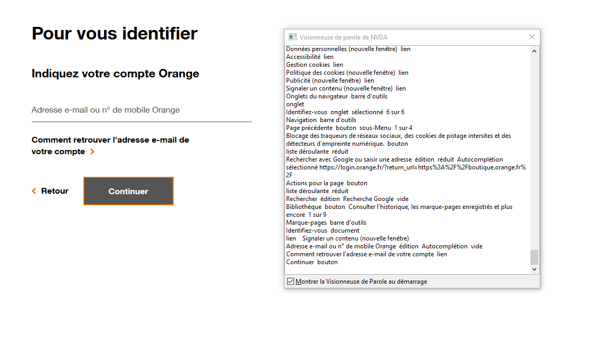
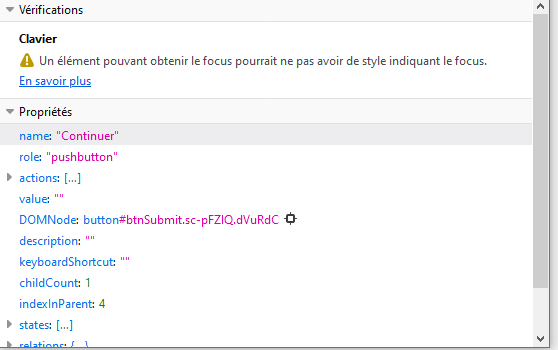
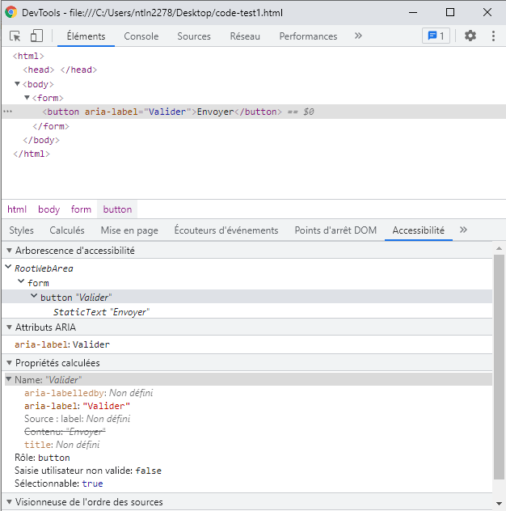

## Objectif du critère

Le critère **WCAG 2.5.3 – Label in Name** vise à garantir que lorsqu’un élément interactif (bouton, lien, champ, etc.) affiche du texte visible à l’écran, ce texte soit également présent dans son **<a href="/src/fr/articles/le-nom-accessible-en-html.md">nom accessible</a>**.  

Cela permet aux utilisateurs [d'aides techniques](/src/fr/solutions-assistance.md) (en particulier de logiciels de reconnaissance vocale) de comprendre et d’interagir correctement avec l’interface.  
En effet, ces outils s’appuient sur le **nom accessible** pour identifier et activer les éléments.  

> Le texte visible n’a pas besoin d’être **strictement identique** au nom accessible, mais il doit **au minimum être inclus** dans celui-ci — idéalement au **début**.

---

## Exemple concret

### Exemple problématique

Prenons l'exemple d'un utilisateur naviguant à l'aide d'un logiciel de reconnaissance vocale souhaitant saisir et soumettre un formulaire.

<pre><code class="html">
&lt;button&gt;
    &lt;img src="envoyer.png" alt="Soumettre"&gt;
&lt;/button&gt;
</code></pre>

Dans cet exemple, le bouton affiche visuellement le mot **« Envoyer »** (dans l’image), mais le texte alternatif est **« Soumettre »**.
Le nom accessible du bouton devient donc *Soumettre*.

Résultat : un utilisateur de reconnaissance vocale qui dit « Cliquer sur Envoyer » ne pourra pas activer le bouton, car l’assistant ne reconnaîtra pas ce nom.

---

### Exemple conforme

<pre><code class="html">
&lt;button&gt;
    &lt;img src="envoyer.png" alt="Envoyer"&gt;
&lt;/button&gt;
</code></pre>

Le nom accessible contient désormais le mot **« Envoyer »**, identique au texte affiché.
Le critère **WCAG 2.5.3 est donc respecté**.

---

## Attention au masquage accessible

Lorsque vous utilisez des éléments masqués visuellement (via des classes telles que `.visually-hidden`), évitez de les insérer **au milieu** d’un intitulé visible.
Sinon, le nom accessible ne correspondra plus à l'intitulé que l’utilisateur voit.

### Exemple d’erreur 
<pre><code class="html">
&lt;a href="www.orange.com" target="_blank"&gt; Ouvrir &lt;span class="visually-hidden"&gt;dans une nouvelle fenêtre &lt;/span&gt; le site d'orange &lt;/a&gt;
</code></pre>

Le nom accessible devient :

> « Ouvrir dans une nouvelle fenêtre le site d’Orange »

Mais l’utilisateur voit seulement :

> « Ouvrir le site d’Orange »

En reconnaissance vocale, dire « Ouvrir le site d’Orange » **ne fonctionnera pas**, car ce texte ne correspond pas au nom accessible réel.

---

## Comment tester la conformité

### 1. Avec un lecteur d’écran

Le lecteur d’écran vocalise :

* la **fonction** de l’élément (bouton, lien, texte, etc.),
* son **statut**,
* et son **nom accessible**.

**Procédure :**

1. Naviguez sur la page avec un lecteur d’écran.
2. Écoutez le nom lu pour chaque bouton ou lien.
3. Si ce nom **ne correspond pas** au texte visible, le critère **n’est pas conforme**.

Certains lecteurs proposent une *visionneuse de paroles* permettant d’afficher le nom accessible sous forme textuelle, ce qui facilite la comparaison avec le texte affiché.

---

### 2. Avec les outils de développement

Le moyen de vérifier le critère avec l'inspecteur de commande dépend du navigateur utilisé.

#### Sous Firefox

1. Ouvrir l’inspecteur de commande : `Ctrl + Maj + I`
2. Sélectionner l’onglet **Accessibilité**
3. Inspecter l’élément à vérifier
4. Dans la section **Propriétés**, vérifier que l’attribut **name** contient au moins le texte visible à l’écran
  

#### Sous Chrome ou Edge Chromium

1. Ouvrir l’inspecteur de commande : `Ctrl + Maj + I`
2. Sélectionner l’onglet **Éléments**
3. Choisir l’élément à inspecter
4. Cliquer sur l’onglet **Accessibilité** (il peut être caché derrière « Plus d’onglets »)
5. Dans la section **Propriétés calculées**, vérifier que l’attribut **name** contient au moins le texte affiché

---

## En résumé

Pour respecter le critère **WCAG 2.5.3**, assurez-vous que :

* Le texte visible d’un élément est inclus dans son nom accessible, si possible au début.
* Les contenus masqués n’altèrent pas la correspondance entre texte visible et nom accessible.
* Les tests peuvent être réalisés avec un lecteur d’écran **et/ou** un inspecteur d’accessibilité.

---

**Ressources associées :**

* [WCAG 2.5.3 – Name in Label (W3C)](https://www.w3.org/TR/WCAG22/#label-in-name)
* [Guide Accessibilité – RGAA](https://accessibilite.numerique.gouv.fr/)
