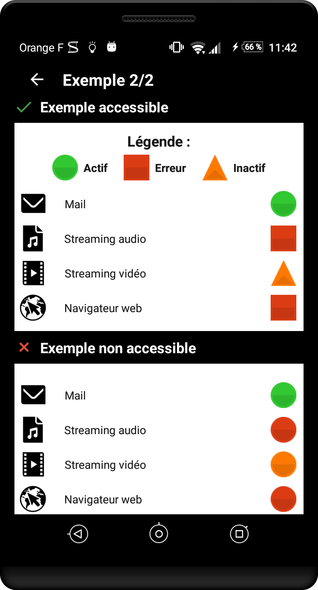

---
title: "Couleurs et contrastes"
---

# Couleurs et contrastes

S'assurer que les couleurs utilisés ne posent pas de problèmes à l'utilisateur

## Assurer un contraste suffisant entre les couleurs de premier plan et de fond

**Cible&nbsp;:** tout le monde (soleil sur l’écran, impression noir et blanc…) et en particulier les personnes malvoyantes, les seniors et les personnes avec des problèmes de vision (daltonisme, vision des contrastes, etc.)  
**Quand&nbsp;:**  dès la phase de conception et lors du développement.

**Description&nbsp;:**
Le niveau de contraste entre le texte ou un composant graphique et l’arrière-plan doit être suffisamment élevé.
Un niveau de contraste insuffisant sera préjudiciable pour les utilisateurs ayant des difficultés visuelles ainsi que pour ceux dans un environnement très lumineux.

**À vérifier&nbsp;:**
- S'assurer que le contraste entre la couleur de fond et du texte, est de :
	- De 4,5:1 minimum pour les petits textes
	- De 3:1 minimum pour les grands textes, ou pour les textes en gras
- S'assurer que les couleurs utilisés dans les composants d'interface, ou que les éléments graphiques porteurs d'informations, ont un contraste de 3:1 par rapport à l'arrière plan. Sont concernés, entre autres : les boutons, les boutons radios, les cases à cocher, les listes de sélection, le focus, les barres de progression etc...

**Outil&nbsp;:**
L’application [Colour Constrast Analyzer](http://www.paciellogroup.com/resources/contrastanalyser/) permet de mesurer rapidement des niveaux de contraste de couleurs (gratuit pour Mac et Windows).  

L’application [AccessibilityScanner](https://play.google.com/store/apps/details?id=com.google.android.apps.accessibility.auditor&hl=fr) permet de tester directement vos applications sur certains critères d’accessibilité et notamment les couleurs. Disponible à partir d’Android 6.

## Ne pas utiliser la couleur ou l’information sensorielle comme seule source d’information 

**Cible&nbsp;:** tout le monde (soleil sur l’écran, impression noir et blanc…) et en particulier les personnes malvoyantes, les seniors et les personnes avec des problèmes de vision (daltonisme, vision des contrastes, etc.)  
**Quand&nbsp;:**  dès la phase de conception et lors du développement.

**Description&nbsp;:**
Ne pas utiliser la couleur ou une information sensorielle (forme, taille, son, orientation, localisation visuelle…) comme la seule façon de véhiculer de l’information, d’indiquer une action, de solliciter une réponse ou de distinguer un élément. L’information fournie par un changement de couleur ou une information sensorielle doit être complétée par une information textuelle (alternative) ou/et structuration sémantique.

**À vérifier&nbsp;:**

- La perte des couleurs ne doit pas entraîner de difficulté dans la navigation, ni provoquer de perte d’information.

**Exemple de contraste non valide&nbsp;:**  
Le texte "film | 20h40 …" ne présente pas un contraste suffisant. Celui-ci ne sera pas lisible par tous les utilisateurs.  

   

**Exemple de passage d’information par la couleur valide et non valide&nbsp;:** 

