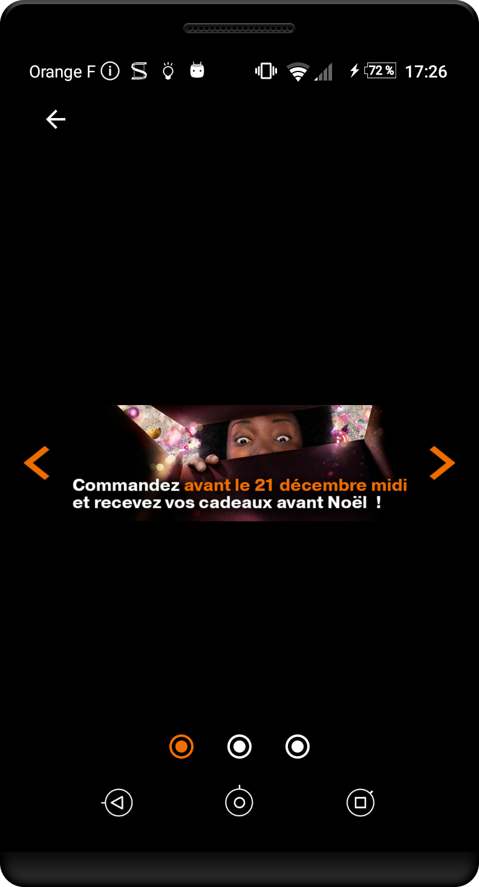
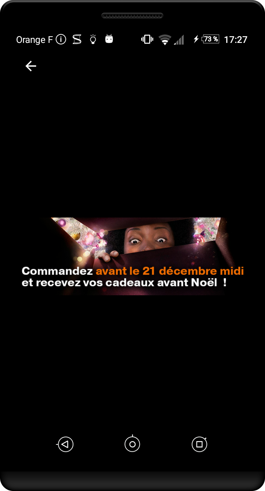

---
title: "Navigation generale"
---

# Navigation generale

## Zone de clic

**Cible&nbsp;:** pour tous et en particulier les personnes avec des déficiences motrices  
**Quand&nbsp;:** dès la phase de conception et lors du développement.

**Description&nbsp;:**  

Une taille insuffisante pour la zone d’action d’un composant peut empêcher certains utilisateurs de profiter pleinement de l’application. Cela peut engendrer des frustrations qui peuvent conduire à la désinstallation de l’application. Chaque élément cliquable de l’application doit donner à l’utilisateur une taille suffisante pour sa zone d’action.

**À vérifier&nbsp;:**

- La zone de clic a une taille d'au minimum 48 dp
- La zone de clic a une marge autour de l'élément d'au moins 8 dp
- Les erreurs de clic peuvent être annulés en déplaçant son doigt hors de la zone cliquable avant de relacher

**Outil&nbsp;:**

L’application [AccessibilityScanner](https://play.google.com/store/apps/details?id=com.google.android.apps.accessibility.auditor&hl=fr) permet de tester directement vos applications sur certains critères d’accessibilité et notamment la taille des zones de clic. Disponible à partir d’Android 6. 

**Exemple valide&nbsp;:** 

Dans les exemples ci-dessous, le cadre noir correspond à la taille de la zone interactive.  

**Exemple non-valide&nbsp;:**  

## Orientation de l’écran
**Cible&nbsp;:** tout le monde et en particulier les personnes avec des déficiences visuelles ou motrices.

**Quand&nbsp;:** lors de la conception et lors du développement.

**Description&nbsp;:**
L’accès au contenu d’une application ne doit pas dépendre de l’orientation de l’écran (portrait et paysage), sauf si une orientation particulière est essentielle pour la compréhension ou l’utilisation du contenu (projection, tableau…).

**À vérifier&nbsp;:**
- L’utilisation de composants graphiques standard qui supportent les deux modes (fragments…), ou définir un `design` spécifique à chaque orientation.
- Que l’application n’est pas verrouillée dans un mode (portrait ou paysage).

## Alternative gestuelle

**Cible&nbsp;:** tout le monde et en particulier les personnes déficientes visuelles et/ou moteur.  
**Quand&nbsp;:** dès la phase de conception et lors du développement.

**Description&nbsp;:**

Naviguer entre plusieurs pages à l'aide d'un swipe horizontal (comme avec les ViewPager notamment) peut devenir très complexe pour les personnes ayant des déficiences moteurs ou visuelles. Il est donc essentielles d'ajouter une alternative, à l'aide de boutons «&nbsp;suivant&nbsp;» et «&nbsp;précédent&nbsp;» par exemple.

**À vérifier&nbsp;:**

- Les actions déclenchés par un geste de l'utilisateur ou un mouvement de l'appareil dispose d'une alternative.

**Objectif utilisateur&nbsp;:**

**Exemple non-valide&nbsp;:**

## Texte

**Cible&nbsp;:** tout le monde et en particulier les personnes déficientes visuelles.  
**Quand&nbsp;:** dès la phase de conception et lors du développement.

**Description&nbsp;:**

Le texte peut poser des problèmes de lisibilité lorsque celui ci présente une police d'écriture avec de l'empatement (différent de sans-serif) ou que sa taille du texte est trop petite. Il est notamment recommandé d'utiliser une taille minimum de 14sp pour les textes. Cela facilitera notamment la lecture pour les dyslexiques.

**À vérifier&nbsp;:**

- La police d'écriture est sans serif
- Les textes sont suffisaments grands pour être lues confortablement
- Il n'y a pas d'italique utilisé

## Composant standard

**Cible&nbsp;:** tout le monde.  
**Quand&nbsp;:** en phase de sélection des briques logicielles et lors des développements.

**Description&nbsp;:**  

L’accessibilité est prise en compte dans les composants natifs (la plupart du temps). De plus, l’utilisation de composants standards permet à l’utilisateur de se retrouver dans une situation et un comportement habituels. La navigation dans une interface standard est donc plus confortable.  
  
Utiliser au maximum les composants natifs en modifiant leur apparence. Si aucun composant standard ne permet de répondre au besoin, créer un composant dédié basé sur un composant standard en veillant à conserver la cohérence de navigation et l’accessibilité.  
  
**Objectif utilisateur&nbsp;:** 

Permet à tous les utilisateurs d’interagir plus intuitivement avec l’interface.

**Objectif technique&nbsp;:**

Améliore globalement la maintenabilité. Réduit les temps de développement. 
