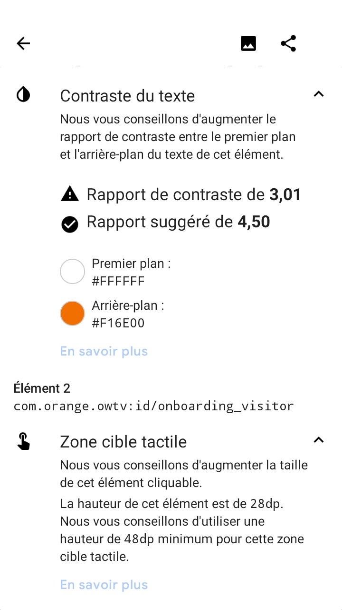
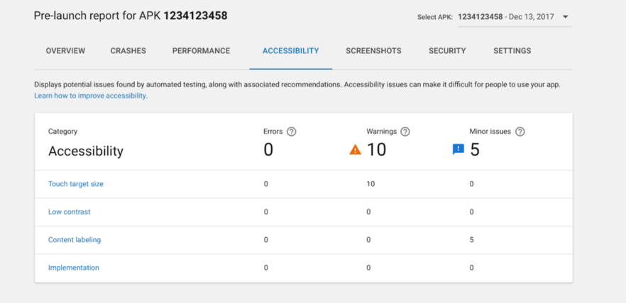

# Scan de l'application : les outils d'analyse

Les outils d’analyse complètent parfaitement la première approche, afin de détecter d’autres problèmes d’accessibilité potentiels, comme ceux liés à la taille des boutons, aux contrastes des couleurs etc…

## Accessibility Scanner

Le [scanner](https://play.google.com/store/apps/details?id=com.google.android.apps.accessibility.auditor) est téléchargeable sur le playstore.

Le scanner prend des captures d’écran de la page et vérifie :
- que l’écran contient des “vocalisations ou label” pour le lecteur d’écran
- que les zones cliquables sont suffisamment grandes et qu’elles ont un label propre 
- Les contrastes de couleur

Attention, il ne s'agit que d'une aide à la vérification, l’outil remonte parfois des faux positifs.

Certaines de ces vérifications font doublon avec `lint`.
En cas de doute sur les contrastes, [Colour contrast analysor](https://developer.paciellogroup.com/resources/contrastanalyser/) permet de faire un diagnostic plus précis.

### Mode opératoire :

- Activer le scanner dans les **paramètres/accessibilité/Accessibility Scanner** (paramètres/accessibilité/Services installés/Accessibility Scanner avec la surcouche de Samsung). Cela affiche un “floating action button” sur l’écran.
- Actionner le bouton sur les écrans à tester. Une capture d’écran est réalisée et la liste des corrections suggérées s’affiche.

**Exemple d'utilisation de l'Accessibility Scanner :**   

Le floating button permettant de générer un rapport lorsque Accessibility Scanner est actif.

Le rapport ainsi généré par Accessibility Scanner une fois le bouton cliqué.

  

## Google Play - Pre Launch Report

Proche de l’analyse effectuée par Accessibility Scanner, Google Play  est en mesure de générer des rapports d’accessibilité après avoir transféré son application sur la console développeur. Celui-ci, s’appuyant sur le même Framework que l’application Accessibility Scanner, vérifie notamment 3 exigences UI au sein de l’application :

- La zone utilisée pour les éléments interactifs : un bouton trop petit sera alors indiqué dans le rapport par exemple
- Les contrastes : vérifie que les ratios de contraste sont respectés entre les textes et leurs backgrounds
- Les descriptions de contenu : vérifie que tous les éléments possèdent un texte pour le décrire à l’utilisateur en cas de besoin

Ce test étant réalisé depuis la console Google Play, cela peut être une dernière vérification faite par le Product Owner lui-même, avant de pousser en production l’application, et ainsi constater que les critères d’accessibilité ont bien été respectés.

**Exemple de rapport généré par Google Play Report :**   

 

## aXe

aXe est une application présente sur le Google Play Store et qui permet, de même que Accessibility Scanner ou que le Pre Launch Report de Google, d’afficher les problèmes d’accessibilité au sein des différents écrans de son application. Bien que redondant avec les deux outils précédents présentés dans certaines vérifications, il est recommandé de l’utiliser en complément, puisqu’il sera en mesure d’afficher des erreurs différentes d’accessibilité, et complètera donc parfaitement les premiers examens, pour avoir un compte rendu plus complet.

L’utilisation d’aXe est très facile, puisqu’il suffit de télécharger l’application et de se laisser ensuite guider. A l’aide d’un floating buton, une analyse pourra être lancée sur l’écran de son choix, et les rapports d’erreurs seront immédiatement retranscrits au bas de l’écran.

**Exemple d'utilisation de aXe :**   

Le floating button de l'application aXe permettant de déclencher un rapport.

   

Le rapport ainsi généré par aXe une fois le bouton cliqué.

   

## UI Automator View

UI Automator View est un outil présent dans le SDK Android, qui permet de scanner et d’analyser les composants UI d’une application Android. Cela permet ainsi de voir la hiérarchie des vues et les différentes propriétés pour chacune d’elle.
Bien que n’étant pas un outil dédié à l’accessibilité, celui-ci peut être utilisé afin d’analyser plus en détail un problème d’accessibilité rencontré, et ainsi mieux en comprendre l’origine.

Pour utiliser cet outil, vous avez donc besoin d’installer le SDK Android. Une fois celui-ci installé, vous devriez pouvoir trouver l’outil au chemin suivant : **C:\users\username\AppData\Local\Android\sdk\tools\uiautomatorviewer.bat**

Il est ainsi possible de l’utiliser au sein d’une application présente sur son téléphone, si celui-ci a le mode développeur activé et qu’il est connecté via un câble USB à l’ordinateur sur lequel UI Automator View/ est lancé. Une fois ces conditions réunies, il suffit de cliquer sur le bouton Device Screenshot dans l’outil pour lancer l’analyse des composants UI de l’écran affiché sur le téléphone.

## Outil tracé des contours

Il est possible sous Android d’afficher les contours des différentes vues d’une application, ce qui permet de détecter les possibles problématiques liées aux dimensions des éléments, de vérifier des marges suffisantes entre divers éléments, et de vérifier que chaque zone sensible a une taille suffisante.
Pour ce faire, il suffit de naviguer dans les paramètres, puis dans les options pour les développeurs du téléphone, et d’activer l’option « Afficher les contours » dans la catégorie « Tracé »

**Exemple d'utilisation du tracé des contours :**   

L'écran des paramètres permettant d'activer le tracé des contours.

 

Exemple d'écran avec le tracé des contours actifs

 

## Colour Contrast Analyser

Les contrastes de couleurs se vérifient sur les maquettes de l’application, ou via Accessibility Scanner sur un mobile Android. Si un doute subsiste, il est possible de faire un screenshot de l’application, puis de faire une vérification sur un ordinateur [Mesurer le niveau de contraste des couleurs](../../../web/outils/methodes-et-outils-de-test/mesurer-contraste-couleurs/) via l'outil Colour Contrast Analyser.
Pour les valeurs à respecter voir la [section concernant les couleurs](../conception#couleurs).

These images are licensed under a Creative Commons Share Alike 2.0 license. Photo credit: <a href="http://www.flickr.com/people/27512715@N02/" hreflang="en">openexhibits</a>

