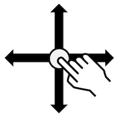
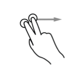

# Les tests manuels : mise en situation

Les tests manuels concernent ceux que vous allez réaliser vous-même, en reproduisant la situation vécue par vos utilisateurs, et donc en utilisant leurs outils d’interaction pour votre application. Il est même préférable de faire tester l’application par de réels utilisateurs en situation de handicap si cela est possible. Plusieurs outils sont donc à utiliser, afin de prendre en compte le maximum de situations possibles : 

## Le lecteur d’écran TalkBack

Le lecteur d’écran est un outil pour les personnes non voyantes et malvoyantes. Il a deux fonctions, la vocalisation et la navigation dans l’écran. Tous les éléments signifiants doivent être **vocalisés** dans un **ordre logique**.

Pour l’activation et l’utilisation du lecteur, vous pourrez obtenir davantage de précision dans la [section concernant TalkBack](../talkback/).

La navigation peut être utilisée en :

- **Lecture par exploration avec le doigt** : en glissant lentement son doigt sur l’écran, Talkback annonce les éléments à mesure qu’on l’on passe son doigt sur l’écran.

   

- **Lecture linéaire** : il est possible d’explorer l’écran, élément par élément en faisant glisser son doigt vers la gauche ou vers la droite pour naviguer entre les éléments, dans l’ordre. Il est aussi possible de parcourir les paramètres de navigation en balayant l’écran vers le haut ou vers le bas jusqu’à obtenir le paramètre souhaité. Le balayage vers la droite ou la gauche se fera alors en utilisant le paramètre choisi ; Les différents paramètres de navigation existants sont : 
	- **Titres** : naviguer par titre
	- **Liens** : naviguer par liens (mail, numéro, sites ou tout autre lien à l’écran)
	- **Commandes** : naviguer par cases à cocher, boutons et autres éléments interactifs
	- **Défaut** : naviguer par ordre d’affichage pour chaque élément
  
  <dl>
    <dt>Double clique avec un doigt</dt>
    <dd>
      
      Active le dernier élément qui a été vocalisé
    </dd>
  <dt>Swipe vers le haut ou vers le bas avec deux doigts</dt>
    <dd>
      
      Scroll dans la page, équivalent à un scroll vertical traditionnel
    </dd>
  <dt>Swipe vers la gauche ou vers la droite avec deux doigts</dt>
    <dd>
      
      Equivalent à un scroll horizontal traditionnel
    </dd>
  <dt>Swipe vers la droite avec un doigt</dt>
    <dd>
      
      Se déplace sur l'élément suivant
    </dd>
  <dt>Swipe vers la gauche avec un doigt</dt>
    <dd>
      
      Se déplace sur l'élément précédent
    </dd>
  <dt>Swipe vers le haut ou vers le bas avec un doigt</dt>
    <dd>
      
      Modifie le paramètre de navigation appliqué
    </dd>
  </dl>

- **Recherche sur écran** : il est possible de naviguer en utilisant la recherche sur l’écran ; pour cela, il faut balayer l’écran vers la gauche, puis vers le bas, saisir le terme de recherche et choisir une correspondance dans la liste fournie.

 

- **Lecture en continu** : Pour utiliser la lecture de l’écran en continu, il faut ouvrir le menu contextuel général avec un balayage vers le bas puis vers la droite, puis choisir l’option (en balayant vers la droite pour la trouver dans le menu) « Lire à partir du haut de page » ou « Lire à partir de l’élément suivant », puis appuyer deux fois dessus pour sélectionner l’option. La lecture en continu démarre alors et peut-être arrêtée en appuyant sur l’écran. 

### Mode opératoire

Parcourir l’application sur les scénarios utilisateurs et vérifier que toutes les informations sont vocalisées dans un ordre logique et compréhensible ainsi que :

- Tous les éléments signifiants sont-ils bien accessibles ?

- Les informations sont-elles vocalisées dans un ordre logique et compréhensible ?

- Les éléments interactifs sont-ils vocalisés avec l’action associée ? (bouton, case à cocher… Appuyer deux fois pour activer)

- Les états des éléments sont-ils précisés ? (désactivé, coché)

- Les messages temporaires, et les alertes sont-ils vocalisés ?

- Les transitions entre les activités sont-elles vocalisées ?

- Les messages d’erreurs et les contenus dynamiques sont-ils vocalisés ?

- Les scrolls horizontaux sont-ils vocalisés ?

- Y-a-t-il la présence d’éléments fantômes ?

- Les titres des activités sont-ils vocalisés ?

- Le workflow est-il facile ? 

- La vocalisation est-elle cohérente, succincte, et simple ?

- Les images décoratives sont-elles bien ignorées ? Et au contraire, les images signifiantes sont-elles vocalisées ?

Idéalement, le test doit se faire sans regarder l’écran, ou en activant l’écran noir (**Assombrir l’écran**).

## Navigation au focus (au clavier)

La navigation dans une application ou une page web doit être possible à l’aide d’un clavier externe (connecté au smartphone par Bluetooth ou USB), afin de reproduire le cas des personnes ne pouvant pas utiliser l’écran tactile, comme celles utilisant un joystick (sur un fauteuil roulant par exemple), ou celles étant atteintes de la maladie de parkinson. Il est important de vérifier son fonctionnement car certains développements peuvent entraîner des difficultés pour naviguer correctement dans la page.
Pour tester la navigation au clavier, il faut connecter un clavier d’ordinateur au smartphone, soit avec un adaptateur (USB - USB C par exemple), soit, si le clavier est , bluetooth, en appairant le clavier et le téléphone. Le clavier , bluetooth a l’avantage de faciliter le débuggage.

### Mode opératoire

Parcourir l’application à l’aide du clavier et vérifier que :
- toutes les fonctionnalités sont accessibles.  
- le focus reste suffisamment visible sur chaque élément recevant ce focus (éléments activables, boutons, éléments cliquables, cases à cocher…).

### Liste des raccourcis clavier principaux&nbsp;: 

- La touche **TAB** pour faire avancer le focus.
- Les touches **maj+TAB** pour faire reculer le focus.
- La touche **entrée** pour activer l’élément qui a le focus (lien, bouton, menu…).
- La **barre espace** pour cocher/décocher une case à cocher.
- Les **flèches directionnelles** pour modifier la sélection des boutons radio, pour se déplacer dans une liste déroulante, ou faire défiler les ascenseurs **scrollbar** ) lorsque ceux-ci sont présents.

Ce sont les mêmes touches utilisées pour tester l'accessibilité d'un site web. Mais l’usage du **Tab** par rapport aux **flèches** ainsi que l’usage de la **barre espace** par rapport à la touche **entrée** sont moins codifiés : on considère le test réussi lorsqu’au moins l’une des deux options permet de réaliser l’action.

Il est considéré comme bloquant l’impossibilité de sortir d’une fonctionnalité ou de l’application.

## Switch Access

**Switch Access** est une application à destination des personnes présentant des troubles moteur. Elle permet de contrôler le téléphone en programmant des touches. Elle ne peut se substituer aux tests claviers, mais reste cependant intéressante à tester, dans le cas de la méthode two switch.

Pour l’activer, il faut procéder comme suit : 

- Aller dans les paramètres du téléphone
- Naviguer dans le menu jusqu’à accessibilité (puis Services installés avec la surcouche Samsung), puis sélectionner Switch Access, puis Paramètres
- Vérifier que la recherche automatique est désactivé
- Utiliser le bouton **Volume Haut** comme correspondant à l’action **Passer à l'option suivante**
- Utiliser le bouton **Volume Bas** comme correspondant à l’action **Selectionner**
- Revenir à l’écran principal de Switch Access et activer ou désactiver l’option d’accessibilité Switch Access quand nécessaire

### Mode opératoire

Parcourir l’application à l’aide du bouton **Passer à l'option suivante** (volume haut).

Puis vérifier que : 
- Le workflow peut-il être parcouru totalement et facilement, dans un ordre cohérent ?
- Les inputs peuvent-ils être édités facilement ?
- Les éléments mis en surbrillance sont-ils seulement ceux sur lesquels on peut réaliser une action ?

### Afficher tout les éléments interactifs

Pour afficher en surbrillance tous les éléments interactifs d’un écran, et ainsi réaliser une vérification rapide, il est possible d’utiliser l’option Group Selection du Switch Access.

Pour ce faire, il faut sélectionner la méthode Group Selection en tant que Scanning Method dans les paramètres du Switch Access, et ensuite attribuer une touche pour le scan.

Une fois au sein de son application, il suffit d’appuyer sur l’action **Select** (volume bas dans notre configuration) pour afficher tous les éléments interactifs de notre écran actuel et ainsi vérifier que :
- Tous les éléments interactifs sont-ils bien mis en surbrillance ?
- N’y a-t-il que des éléments interactifs en surbrillance ?

## Agrandissement

Android propose plusieurs options d’agrandissement :
- Taille de la police
- Taille d’affichage
- Agrandissement (zoom)

Lire les instructions lors de l’activation des outils.

### Mode opératoire :

- Positionner **Taille de la police** et **Taille d’affichage** au maximum. Parcourir l’application et noter les textes qui ne sont plus lisibles car ils ont disparu ou se chevauchent.
- Activez l'option **Agrandissement** dans les paramètres d'accessibilité. Revenez à votre application et appuyez 3 fois sur l'écran (si vous avez conservé ce raccourci) pour démarrer l'affichage avec grossissement. Vérifiez que les écrans sont lisibles dans ce mode. Pincez avec 2 doigts pour régler le zoom et faites glisser 2 doigts pour vous déplacer sur l'écran. Toutes les informations sur l'écran doivent être lisibles en mode zoom.

## Orientation

Il est nécessaire de vérifier l’orientation de son application, celle-ci devant fonctionner aussi bien en mode Paysage, qu’en mode portrait. Il convient donc de réaliser les tests manuels dans les deux cas, puisque contraindre l’utilisateur à un seul mode, pose des problèmes d’accessibilité.

## Accessibility timeouts

Cet outil n’est disponible qu’à partir de Android Q.

Sur certaines applications, il arrive que l’UI change après un certain délai (par exemple la disparition des boutons de contrôles sur un lecteur vidéo après quelques secondes). Ce délai peut être adapté en fonction du besoin de chacun dans les paramètres, certains utilisateurs ayant besoin de plus de temps pour réussir à « voir » les contrôles et à interagir avec eux (que ce soit par le biais d’une assistance ou non). On peut alors faire appel à cette fonction de AccessibilityManager qui permet d’obtenir le timeout recommandé pour l’utilisateur, en fonction de ces préférences en matière d’accessibilité : `public int getRecommendedTimeoutMillis (int originalTimeout, 
                int uiContentFlags)`

Ainsi, pour tester si ce besoin d’accessibilité est bien pris en compte par l’application, il faut procéder comme suit : 

- Aller dans les paramètres du téléphone
- Naviguer dans le menu jusqu’à accessibilité, puis sélectionner Time to take action
- Choisir un délai dans les options proposées
- Vérifier que l’application s’adapte bien au délai indiqué précédemment, pour les changements d’UI potentiellement concernés par ce délai.

## Voice Access

[Voice Access](https://play.google.com/store/apps/details?id=com.google.android.apps.accessibility.voiceaccess) est une application intégrée à [Android Accessibility Suite](https://play.google.com/store/apps/details?id=com.google.android.marvin.talkback), à destination des personnes présentant des troubles moteur. Elle permet de commander à la voix l’application à la place de l’écran tactile.

Parmi les commandes possibles : 
- Ouvrir « application »
- Retour
- Accueil
- Afficher les notifications
- Faire défiler vers le haut
- Faire défiler vers la droite
- Faire défiler jusqu’en bas
- Balayer vers l’avant
- Etc..

Une fois Voice Access activée, des numéros s’affichent à côté de tous les éléments de l’écran avec lesquels il est possible d’interagir. Si on souhaite ainsi interagir avec un bouton **Valider** qui a pour numéro 6, on peut énoncer les commandes suivantes :
- 6
- Valider
- Cliquer sur 6
- Cliquer sur Valider

Il convient donc de tester qu’il n’y a pas plusieurs labels identiques pour des éléments interactifs au sein d’un même écran. Même si l’utilisateur peut toujours passer par le numéro pour la commande vocale, cela limite la possibilité de passer par son nom. Il est aussi utile de tester qu’on peut bien ouvrir l’application par son nom, avec la commande **Ouvrir "application"**.

**Exemple d'utilisation de Voice Access :**   

Exemple d'écran proposant le floating button qui permet de démarrer Voice Access.

 

Exemple d'écran avec Voice Access activé

 

## Sélectionner pour prononcer

Sélectionner pour prononcer est un outil intégré à Android Accessibility Suite qui permet de lire les parties de l’écran qui sont sélectionnées.

Lorsqu’un seul élément est sélectionné, l'outil vocalise l’élément. Lorsque plusieurs éléments sont sélectionnés, il implémente un ordre logique de lecture comme Talkback mais il n’implémente pas les actions ni l’état des éléments.

Il est utile pour les malvoyants, lorsque l’écran n’est pas lisible, pour l’apprentissage de la lecture (fonctionne comme un karaoké) ou pour l’apprentissage d’une langue étrangère.

Il peut être utilisé dans un but de démonstration mais est redondant avec Talkback pour des tests d’accessibilité sans pouvoir le remplacer.

These images are licensed under a Creative Commons Share Alike 2.0 license. Photo credit: <a href="http://www.flickr.com/people/27512715@N02/" hreflang="en">openexhibits</a>
