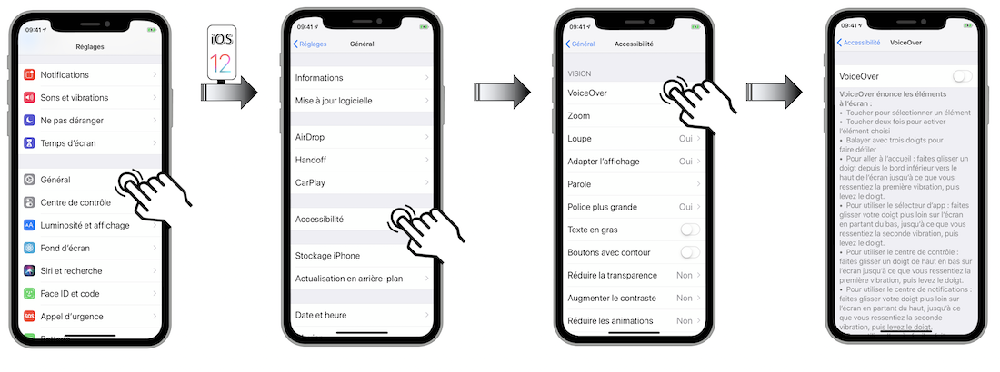
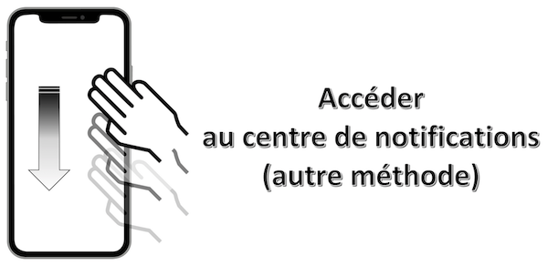
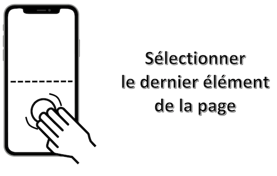
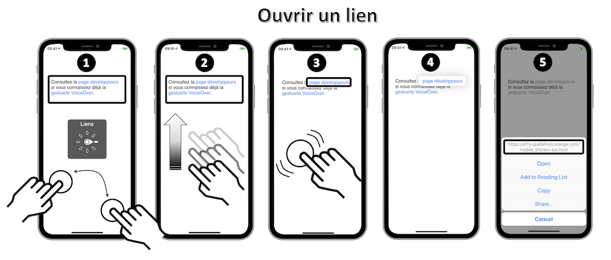

# Guide d’utilisation de VoiceOver

VoiceOver est le lecteur d’écran natif iOS qui décrit à haute voix les éléments qui apparaissent sur l’écran de votre terminal.
 Il permet à un utilisateur malvoyant ou nonvoyant, dyslexique ou illettré de pouvoir vocaliser tous les éléments visibles contenus dans la page.

L'activation de VoiceOver se fait via le menu `Réglages` du téléphone&nbsp;:

<ul class="nav nav-tabs" role="tablist">
    <li class="nav-item" role="presentation">
        <a class="nav-link active"
           data-toggle="tab" 
           href="#VoiceOverActivation-iOS13"
           role="tab" 
           aria-selected="true">iOS 13</a>
    </li>
    <li class="nav-item" role="presentation">
        <a class="nav-link" 
           data-toggle="tab" 
           href="#VoiceOverActivation-iOS12"
           role="tab" 
           aria-selected="false">iOS 12</a>
    </li>
</ul>

    

     

 Lorsque l'activation est effective, les gestes standards effectués sur l’écran tactile donnent des résultats différents.
 Cependant, des gestes supplémentaires permettent de se déplacer à l’écran et de contrôler des éléments sélectionnés.

Il est préférable mais non obligatoire d'**activer la vibration** pour percevoir le point de déclenchement de certaines fonctionnalités.

<ul class="nav nav-tabs" role="tablist">
    <li class="nav-item" role="presentation">
        <a class="nav-link active"
           data-toggle="tab" 
           href="#iPhoneVibration-iOS13"
           role="tab" 
           aria-selected="true">iOS 13</a>
    </li>
    <li class="nav-item" role="presentation">
        <a class="nav-link" 
           data-toggle="tab" 
           href="#iPhoneVibration-iOS12"
           role="tab" 
           aria-selected="false">iOS 12</a>
    </li>
</ul>

    

     

 Si cette fonction est désactivée, il est toutefois possible d'entendre un bip signalant le déclenchement qui risque néanmoins d'être parasité par la vocalisation.

Deux mouvements principaux sont importants à maîtriser pour appliquer sans problème les détails fournis par la suite&nbsp;:

Le **balayage** qui consiste à décoller le doigt de l'écran à l'issue du mouvement tout en le poursuivant.

Le **glissement** qui consiste à réaliser le mouvement défini en gardant continuellement le contact entre le doigt et l'écran.

Dans une première partie, nous décrirons les gestes de base liés à une utilisation courante de VoiceOver pour ensuite traiter le cas spécifique de l'iPhone X et finir avec des manipulations peu courantes mais néanmoins très utiles pour l'utilisateur avancé.

  
## Gestes de bases
<ul class="list-gesture">
  <li class="clearfix">
    

<h3>Se déplacer avec un doigt sur l’écran</h3>

Explorer l’écran et entendre la vocalisation de l’élément qui est touché.

  </li>  
  <li class="clearfix">
    
   
<h3>Double-cliquer n’importe où sur l’écran</h3>

Ouvrir ou activer l’élément qui a été touché (vocalisé) en dernier.

  </li>  
    <li class="clearfix">

<h3>Balayer vers le haut ou le bas en utilisant trois doigts</h3>

Se déplacer verticalement sur une liste ou sur une page à condition qu’elle soit sélectionnée. Correspond à un balayage vertical.
  
  </li> 
  <li class="clearfix">

<h3>Balayer vers la gauche ou la droite en utilisant trois doigts</h3>

Changer de page ou d’écran quand c’est possible. Correspond à un balayage horizontal.

  </li> 
  <li class="clearfix">

   
<h3>Balayer vers la gauche (resp. droite) en utilisant un doigt</h3>

Déplacer le focus VoiceOver sur le prochain (resp. précédent) élément.

  </li> 
  <li class="clearfix">

 
<h3>Balayer vers le haut (resp. bas) en utilisant un doigt</h3>

Permet d’augmenter (resp. diminuer) la valeur d’un élément ajustable.

  </li>
</ul>

  
## iPhoneX
L'arrivée sur le marché de ce terminal sous iOS11 avec l'absence de bouton principal a quelque peu bouleversé la gestuelle classique dont on avait l'habitude.
 Ces [nouveaux gestes de base](./iphone-x) ont donc fortement impacté les manipulations VoiceOver dont les principales sont fournies ci-dessous&nbsp;:
- [revenir à l'écran d'accueil,](#BackHome)

- [accéder au multitâche,](#Multitask)

- [accéder au centre de contrôle,](#ControlCenter)

- [accéder au centre de notifications.](#NotificationCenter)

 Mouvement&nbsp;: **balayage** à partir du bas de l'écran avec **un doigt** jusqu'à sentir l'émission d'une **simple vibration** (environ au **premier quart inférieur de l'écran**).

  Mouvement&nbsp;: **balayage** à partir du bas de l'écran avec **un doigt** jusqu'à sentir une **double vibration** (environ à la **moitié de l'écran**).

 Mouvement&nbsp;: **balayage avec 1 doigt** à partir du haut de l'écran jusqu'à sentir l'émission d'une **simple vibration** (environ au **premier quart supérieur de l'écran**).

 Mouvement&nbsp;: **balayage avec 1 doigt** à partir du haut de l'écran jusqu'à sentir l'émission d'une **double vibration** (environ à la **moitié de l'écran**).

  
## Trucs & Astuces
Cette partie contient des manipulations qui ne sont pas forcément toutes très connues mais qui peuvent s'avérer très utiles sur **tout type de terminal**&nbsp;:

- [lire tous les éléments à partir du haut de la page,](#ReadAllElementsFromTop)

- [lire tous les éléments à partir de la sélection,](#ReadAllElementsFromSelection)

- [arrêter/redémarrer la lecture automatique des éléments,](#ToggleAutomaticReading)

- [localiser l'élément sélectionné,](#LocateSelectedElement)

- [arrêter/redémarrer l'énonciation VoiceOver,](#ToggleSpeech)

- [accéder au centre de contrôle,](#ControlCenterBis)

- [accéder au centre de notifications,](#NotificationCenterBis)

- [activer un élément sélectionné,](#ElementActivation)

- [revenir à la page précédente,](#Scrub)

- [trouver un élément avec le sélecteur d'éléments,](#ItemChooserList)

- [sélectionner le premier élément d'une page,](#PageFirstElement)

- [sélectionner le dernier élément d'une page,](#PageLastElement)

- [activer/désactiver l'écran "rideau",](#CurtainScreen)

- [changer la vocalisation d'un élément,](#CustomLabel)

- [lancer une recherche,](#SpotlightSearch)

- [réaliser un appui long,](#LongPressure)

- [ouvrir un lien dans une vue.](#OpenLink)

 Mouvement&nbsp;: **balayage avec 2 doigts** du bas vers le haut n'importe où sur l'écran.

 Mouvement&nbsp;: **balayage avec 2 doigts** du haut vers le bas n'importe où sur l'écran.

 Mouvement&nbsp;: **simple tap avec 2 doigts** n'importe où sur l'écran.

 Mouvement&nbsp;: **simple tap avec 3 doigts** n'importe où sur l'écran.

 Mouvement&nbsp;: **double tap avec 3 doigts** n'importe où sur l'écran.
 Si la fonctionnalité `zoom` est activée dans les réglages, il faudra réaliser un **triple tap** pour obtenir le résultat souhaité.

 Il faut au préalable **sélectionner un élément de la barre d'état** en haut de l'écran.
 Mouvement&nbsp;: **balayage avec 3 doigts** du bas vers le haut n'importe où sur l'écran.

 

 Il faut au préalable **sélectionner un élément de la barre d'état** en haut de l'écran.
 Mouvement&nbsp;: **balayage avec 3 doigts** du haut vers le bas n'importe où sur l'écran.

 Mouvement&nbsp;: **sélectionner** l'élément désiré **avec un doigt en maintenant la pression** puis effectuer un **simple tap avec un autre doigt** n'importe où sur l'écran.
 Cette gestuelle est très pratique pour taper au clavier en utilisant l'index pour sélectionner la lettre et le majeur pour réaliser le simple tap.

 Mouvement&nbsp;: **glissement avec 2 doigts en dessinant un 'Z'** n'importe où sur l'écran.
 Cette manipulation aboutit exactement au même résultat que l'appui sur le bouton retour natif d'un écran.

 Mouvement&nbsp;: **triple tap avec 2 doigts** n'importe où sur l'écran.

 Mouvement&nbsp;: **simple tap avec 4 doigts** dans la moitié supérieure de l'écran.

 Mouvement&nbsp;: **simple tap avec 4 doigts** dans la moitié inférieure de l'écran.

 Mouvement&nbsp;: **triple tap avec 3 doigts** n'importe où sur l'écran.
 Si la fonctionnalité `zoom` est activée dans les réglages, il faudra réaliser un **quadruple tap** pour obtenir le résultat souhaité.
 Cette fonctionnalité permet de continuer la navigation avec VoiceOver en ayant un écran éteint favorisant ainsi à la fois la confidentialité et la longévité de la batterie.

 Mouvement&nbsp;: **double tap avec 2 doigts en maintenant la pression** n'importe où sur l'écran.

 Mouvement&nbsp;: **balayage avec 3 doigts** vers le bas n'importe où sur l'écran.

 Mouvement&nbsp;: **double tap avec 1 doigt en maintenant la pression** *(iOS 12)* ou ** triple tap avec un doigt** *(iOS 13)* n'importe où sur l'écran.

 Mouvement&nbsp;: **double tap avec 1 doigt en maintenant la pression** n'importe où sur l'écran.
 Sélectionner l'option 'Liens' du rotor avant de balayer vers le haut pour atteindre le lien souhaité.
 Ensuite, effectuer un double tap avec 1 doigt en maintenant la pression **jusqu'à l'apparition d'une popup au-dessus du lien** qui affichera une fenêtre d'actions en bas d'écran.

