# WWDC 2019 : Quelques enseignements en accessibilité

Cette session regroupe quatre courtes interventions toutes visualisables sur le **site développeur officiel d'Apple**&nbsp;:

- [Nouveautés&nbsp;iOS&nbsp;13&nbsp;pour&nbsp;l'accessibilité&nbsp;visuelle](#nouveautes-ios-13-pour-laccessibilite-visuelle)

- [Découvrir&nbsp;Accessibility&nbsp;Inspector](#decouvrir-accessibility-inspector)

- [La&nbsp;bonne&nbsp;rédaction&nbsp;des&nbsp;labels](#la-bonne-redaction-des-labels)

- [Utiliser&nbsp;les&nbsp;actions&nbsp;personnalisées](#utiliser-les-actions-personnalisees)

 Par la suite, selon la configuration de la présentation, le fait de cliquer sur un titre ou un temps indiqué permet d'ouvrir la vidéo Apple directement au moment spécifié.
  
## Nouveautés iOS 13 pour l'accessibilité visuelle
Cette présentation visualisable sur le site développeur officiel d'Apple ([session 244](https://developer.apple.com/videos/play/wwdc2019/244/)) développe certains points pour **rendre une application la plus accessible possible au niveau visuel**.

 Les thèmes abordés au sein de la vidéo sont détaillés ci-dessous :

- **Dynamic Type**
    - <a role="button" style="text-decoration: underline" onclick="$('#DynamicType-TheFourPrinciples_tab').trigger('click');document.getElementById('dynamic-type').scrollIntoView({ behavior: 'smooth', block: 'start' })">Les quatre principes</a>
    - <a role="button" style="text-decoration: underline" onclick="$('#DynamicType-TextStyles_tab').trigger('click');document.getElementById('dynamic-type').scrollIntoView({ behavior: 'smooth', block: 'start' })">Les styles de texte</a>
    - <a role="button" style="text-decoration: underline" onclick="$('#DynamicType-Xcode_tab').trigger('click');document.getElementById('dynamic-type').scrollIntoView({ behavior: 'smooth', block: 'start' })">Xcode</a> ⟹ **nouveauté iOS 13**
 
- **Réduction de mouvement**
    - <a role="button" style="text-decoration: underline" onclick="$('#ReduceMotion-TheBasics_tab').trigger('click');document.getElementById('reduction-de-mouvement').scrollIntoView({ behavior: 'smooth', block: 'start' })">Fondamentaux</a>
    - <a role="button" style="text-decoration: underline" onclick="$('#ReduceMotion-AutoplayingVideo_tab').trigger('click');document.getElementById('reduction-de-mouvement').scrollIntoView({ behavior: 'smooth', block: 'start' })">Prévisualisation vidéo</a> ⟹ **nouveauté iOS 13**
    - <a role="button" style="text-decoration: underline" onclick="$('#ReduceMotion-ScreenTransitions_tab').trigger('click');document.getElementById('reduction-de-mouvement').scrollIntoView({ behavior: 'smooth', block: 'start' })">Transitions entre écrans</a> ⟹ **nouveauté iOS 13**
 
- **Couleur**
    - <a role="button" style="text-decoration: underline" onclick="$('#Color-TheBasics_tab').trigger('click');document.getElementById('couleur').scrollIntoView({ behavior: 'smooth', block: 'start' })">Fondamentaux</a>
    - <a role="button" style="text-decoration: underline" onclick="$('#Color-DifferentiateWithoutColor_tab').trigger('click');document.getElementById('couleur').scrollIntoView({ behavior: 'smooth', block: 'start' })">Couleur et forme</a> ⟹ **nouveauté iOS 13**

  
### Dynamic Type
<ul class="nav nav-tabs" role="tablist">
    <li class="nav-item" role="presentation">
        <a class="nav-link active"
           data-toggle="tab" 
           href="#DynamicType-TheFourPrinciples"
           id="DynamicType-TheFourPrinciples_tab"
           role="tab" 
           aria-selected="true">Les quatre principes</a>
    </li>
    <li class="nav-item" role="presentation">
        <a class="nav-link" 
           data-toggle="tab" 
           href="#DynamicType-TextStyles"
           id="DynamicType-TextStyles_tab"
           role="tab" 
           aria-selected="false">Les styles de texte</a>
    </li>
    <li class="nav-item" role="presentation">
        <a class="nav-link" 
           data-toggle="tab" 
           href="#DynamicType-Xcode"
           id="DynamicType-Xcode_tab"
           role="tab" 
           aria-selected="false">Xcode</a>
    </li>
</ul>

    
<a alt="Lien vers l'extrait vidéo au temps indiqué." href="https://developer.apple.com/videos/play/wwdc2019/244/?time=77">🎬 (01:17)</a>
 L'utilisation du `Dynamic`&nbsp;`Type` s'appuie sur quatre principes qu'il est vivement recommandé de suivre&nbsp;: 
<ul>
  <li>tout texte dont la taille peut être augmentée se doit d'être implémenté de cette façon,</li>
     
  <li>toute la largeur de l'écran doit être utilisée,</li>
     
  <li>ne pas ajouter une troncature de mots si elle n'est pas présente sur le grossissement "standard" de l'application,</li>
     
  <li>la taille des textes et celle des éléments graphiques doivent augmenter conjointement de façon à conserver un ensemble visuel équilibré. </li>
</ul>

<a alt="Lien vers l'extrait vidéo au temps indiqué." href="https://developer.apple.com/videos/play/wwdc2019/244/?time=110">🎬 (01:50)</a>
  
Petit rappel sur les 11 styles de texte disponibles depuis iOS 11&nbsp;:
    
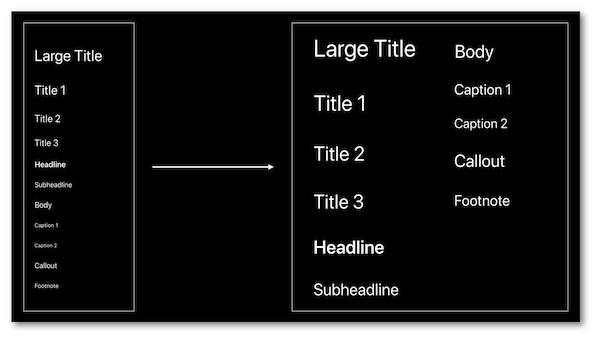

... ainsi que sur la façon programmatique de les implémenter&nbsp;:

Une explication détaillée de l'implémentation du `Dynamic`&nbsp;`Type` est disponible dans la partie <a href="../../developpement#taille-des-textes" style="text-decoration: underline;">guide pour les développeurs</a>.

    
<a alt="Lien vers l'extrait vidéo au temps indiqué." href="https://developer.apple.com/videos/play/wwdc2019/244/?time=180">🎬 (03:00)</a>

Un **nouvel écran** apparaît sous **Xcode 11** pour modifier et visualiser le grossissement de texte de façon dynamique sur le simulateur.
    
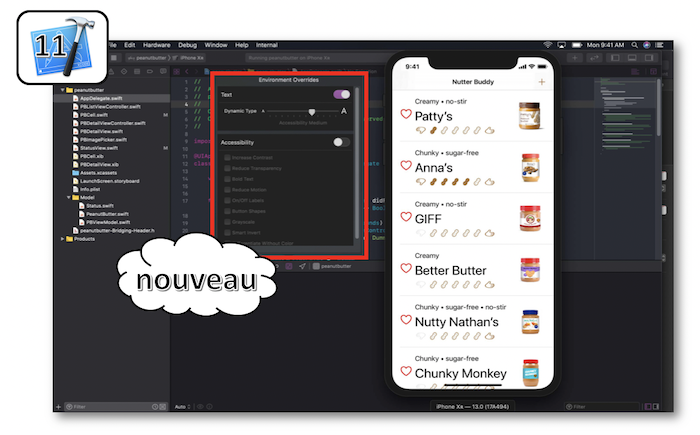

  
### Réduction de mouvement
<ul class="nav nav-tabs" role="tablist">
    <li class="nav-item" role="presentation">
        <a class="nav-link active"
           data-toggle="tab" 
           href="#ReduceMotion-TheBasics"
           id="ReduceMotion-TheBasics_tab"
           role="tab" 
           aria-selected="true">Fondamentaux</a>
    </li>
    <li class="nav-item" role="presentation">
        <a class="nav-link" 
           data-toggle="tab" 
           href="#ReduceMotion-AutoplayingVideo"
           id="ReduceMotion-AutoplayingVideo_tab"
           role="tab" 
           aria-selected="false">Prévisualisation vidéo</a>
    </li>
    <li class="nav-item" role="presentation">
        <a class="nav-link" 
           data-toggle="tab" 
           href="#ReduceMotion-ScreenTransitions"
           id="ReduceMotion-ScreenTransitions_tab"
           role="tab" 
           aria-selected="false">Transitions entre écrans</a>
    </li>
</ul>

    
<a alt="Lien vers l'extrait vidéo au temps indiqué." href="https://developer.apple.com/videos/play/wwdc2019/244/?time=203">🎬 (03:23)</a>

Petit rappel sur la situation actuelle incluant la fonctionnalité déjà présente pour minimiser le mouvement à l'écran&nbsp;:
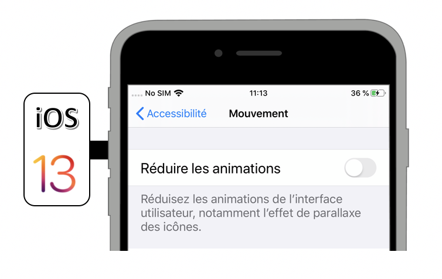

... ainsi que sur la façon programmatique de connaître sa valeur issue des réglages du terminal&nbsp;:

Une explication détaillée des états et des événements des options d'accessibilité est disponible dans la partie <a href="../../developpement#options-daccessibilite" style="text-decoration: underline;">guide&nbsp;pour&nbsp;les&nbsp;développeurs</a>.

    
<a alt="Lien vers l'extrait vidéo au temps indiqué." href="https://developer.apple.com/videos/play/wwdc2019/244/?time=257">🎬 (04:17)</a>

**Nouvelle fonctionnalité iOS&nbsp;13**, la prévisualisation automatique de vidéos est désormais à la main de l'utilisateur qui peut décider de son activation via les réglages du terminal&nbsp;:

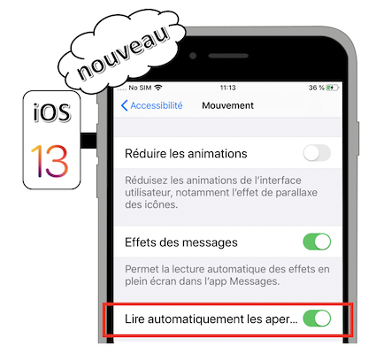
Il est aussi possible de connaître l'état de cette option de façon programmatique&nbsp;:

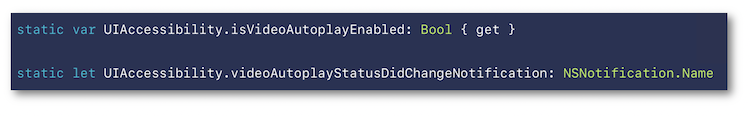
Dans le cas où cette option est désactivée, seule une interaction volontaire de l'utilisateur doit permettre le contrôle de la vidéo.

    
<a alt="Lien vers l'extrait vidéo au temps indiqué." href="https://developer.apple.com/videos/play/wwdc2019/244/?time=343">🎬 (05:43)</a>

Cette **nouvelle fonctionnalité iOS&nbsp;13** n'apparaît qu'à partir du moment où l'option d'accessibilité `Réduire`&nbsp;`les`&nbsp;`animations` est activée.

Elle permet un passage entre les différentes écrans moins perturbant pour certains utilisateurs dont l'adaptation visuelle aux mouvements est particulièrement sensible.
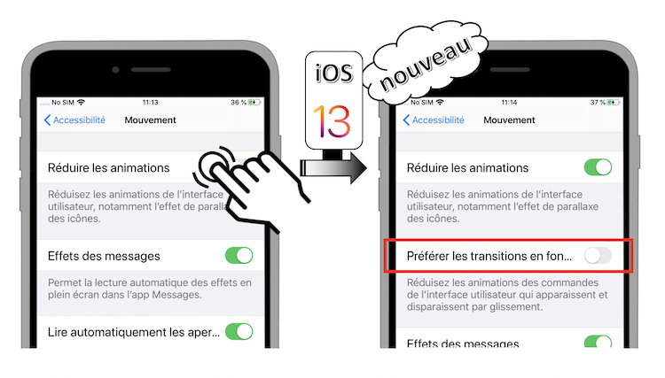

Une fois activée, l'option `Préférer`&nbsp;`les`&nbsp;`transisitions`&nbsp;`enchaînées` fonctionne automatiquement tant qu'on utilise les éléments standards de UIKit (navigation, vues modales...).

  
### Couleur
<ul class="nav nav-tabs" role="tablist">
    <li class="nav-item" role="presentation">
        <a class="nav-link active"
           data-toggle="tab" 
           href="#Color-TheBasics"
           id="Color-TheBasics_tab"
           role="tab" 
           aria-selected="true">Fondamentaux</a>
    </li>
    <li class="nav-item" role="presentation">
        <a class="nav-link" 
           data-toggle="tab" 
           href="#Color-DifferentiateWithoutColor"
           id="Color-DifferentiateWithoutColor_tab"
           role="tab" 
           aria-selected="false">Couleur et forme</a>
    </li>
</ul>

    
<a alt="Lien vers l'extrait vidéo au temps indiqué." href="https://developer.apple.com/videos/play/wwdc2019/244/?time=400">🎬 (06:40)</a>

Présentation de quelques dyschromatopsies qui vont permettre de mieux comprendre l'arrivée de la nouvelle fonctionnalité proposée dans l'onglet suivant.

    
<a alt="Lien vers l'extrait vidéo au temps indiqué." href="https://developer.apple.com/videos/play/wwdc2019/244/?time=453">🎬 (07:33)</a>

La **nouvelle fonctionnalité iOS&nbsp;13** `Différencier`&nbsp;`sans`&nbsp;`couleur` permet à l'utilisateur d'indiquer sa préférence à ne surtout **pas utiliser la couleur pour faire passer une information**.
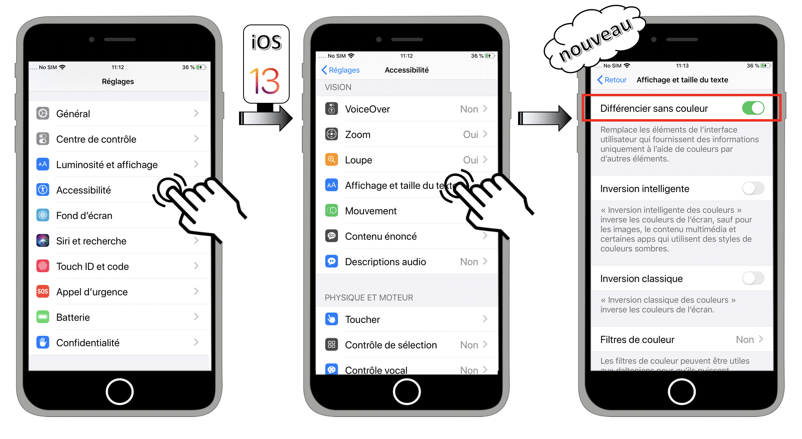

La valeur de cette option est accessible de façon programmatique afin d'adapter subséquemment le visuel d'une application&nbsp;:
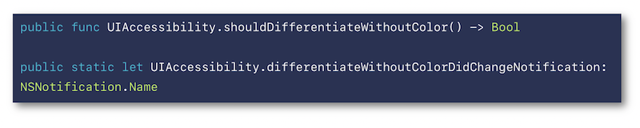

Il est bien évidemment recommandé de <a href="../../conception#couleurs" style="text-decoration: underline;">ne jamais faire passer une information par la couleur uniquement</a> mais il y a des cas spécifiques où ce type de configuration est primordial et où l'intérêt de rajouter des éléments graphiques pour différencier les couleurs a un intérêt non négligeable (jeu vidéo par exemple).

   
## Découvrir Accessibility Inspector
Cette présentation visualisable sur le **site développeur officiel d'Apple** ([session&nbsp;257](https://developer.apple.com/videos/play/wwdc2019/257/)) a pour but de présenter l'outil Accessibility Inspector ainsi que quelques nouveautés Xcode&nbsp;11 qui vont permettre de résoudre certains problèmes exposés au sein de l'application de démonstration.
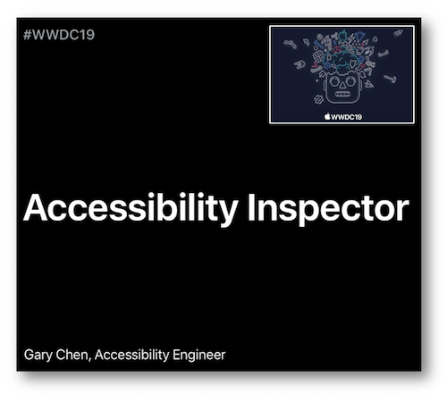
 Les thèmes abordés ainsi que leur référence temporelle au sein de la vidéo sont décrits ci-dessous :

- [Présentation](#presentation-0051) (00:51)

- [Audit](#audit-0226) (02:26)

- [Inspection](#inspection-0340) (03:40) incluant une **nouveauté Xcode&nbsp;11**

- [CATextLayer](#catextlayer-0526) (05:26)

- [Contraste&nbsp;des&nbsp;couleurs](#contraste-des-couleurs-0626) (06:26) incluant une **nouveauté Xcode&nbsp;11**

- [Bilan](#bilan-0824) (08:24)
  
### [Présentation (00:51)](https://developer.apple.com/videos/play/wwdc2019/257/?time=51)

L'application de démonstration qui va servir tout au long de cette présentation est expliquée de façon à mieux comprendre la future problématique remontée par l'outil avec mise en avant de&nbsp;:

- la façon d'accéder à Accessibility Inspector [(01:34)](https://developer.apple.com/videos/play/wwdc2019/257/?time=94),

- la fonctionnalité de grossissement `hover`&nbsp;`text` [(01:43)](https://developer.apple.com/videos/play/wwdc2019/257/?time=103).
  
### [Audit (02:26)](https://developer.apple.com/videos/play/wwdc2019/257/?time=146)
Cette fonctionnalité a pour but de présenter une liste de problèmes potentiels détectés par l'outil en accessibilité.

  
### [Inspection (03:40)](https://developer.apple.com/videos/play/wwdc2019/257/?time=220)
Après avoir montré comment activer une sélection d'éléments graphiques concomittante à la description affichée, la **nouvelle fonctionnalité Xcode&nbsp;11** qui permet la **vocalisation et la sélection d'éléments sur simulateur** [(04:11)](https://developer.apple.com/videos/play/wwdc2019/257/?time=251) est enfin dévoilée.

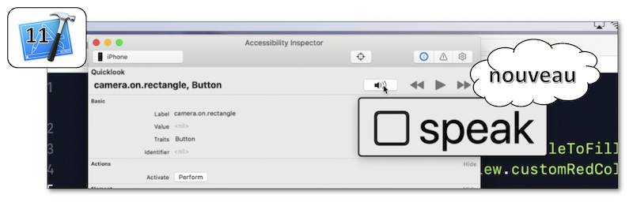
  
### [CATextLayer (05:26)](https://developer.apple.com/videos/play/wwdc2019/257/?time=326)
Cet exemple met en avant le fait que l'accessibilité pour ce type d'élément n'est pas du tout géré automatiquement par le système et doit absolument être implémenté de façon programmatique.
  
### [Contraste des couleurs (06:26)](https://developer.apple.com/videos/play/wwdc2019/257/?time=386)
Hormis le fait d'avoir des polices de taille suffisamment grande pour être perçues par tous, il est aussi primordial de [respecter&nbsp;un&nbsp;contraste&nbsp;de&nbsp;couleurs](../../conception#couleurs) pour permettre à l'ensemble des personnes ayant des troubles visuels de distinguer parfaitement ce qui est sur l'écran.

Une fois le problème décelé, une solution est apportée par la **nouvelle fonctionnalité Xcode&nbsp;11**&nbsp;: **Color Contrast Calculator**.
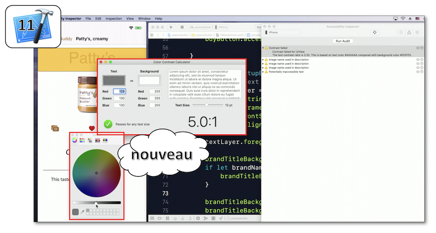
  
### [Bilan (08:24)](https://developer.apple.com/videos/play/wwdc2019/257/?time=504)
Utilisations des outils présentés lors de la session pour visualiser le rendu final et s'assurer que les solutions avancées fonctionnent parfaitement.

   
## La bonne rédaction des labels
Cette présentation visualisable sur le **site développeur officiel d'Apple** ([session&nbsp;254](https://developer.apple.com/videos/play/wwdc2019/254/)) est réalisée par une personne non voyante qui explique l'importance de bien vocaliser les éléments accessibles par le biais d'exemples concrets et de bonnes pratiques.

Après une brève introduction concernant les attentes d'un utilisateur VoiceOver sur le **premier lancement d'une application mobile** inconnue pour lui [(00:13)](https://developer.apple.com/videos/play/wwdc2019/254/?time=13), la **définition d'un label** est présentée en détails [(01:53)](https://developer.apple.com/videos/play/wwdc2019/254/?time=113) suivie d'**explications sur différents contextes qui induisent une vocalisation adaptée** pour un même élément accessible [(02:41)](https://developer.apple.com/videos/play/wwdc2019/254/?time=161).

 La seconde partie de la présentation consiste à développer un ensemble des bonnes pratiques agrémentées d'exemples concrets&nbsp;: [(04:24)](https://developer.apple.com/videos/play/wwdc2019/254/?time=264)

- toujours ajouter des labels appropriés aux éléments accessibles [(04:33)](https://developer.apple.com/videos/play/wwdc2019/254/?time=273),

- ne pas insérer le type de l'élément accessible dans son label [(05:22)](https://developer.apple.com/videos/play/wwdc2019/254/?time=322),

- notifier l'utilisateur lors de mises à jour informatives de l'interface graphique [(05:46)](https://developer.apple.com/videos/play/wwdc2019/254/?time=346),

- ajouter une clarification sur le contexte quand cela est nécessaire pour la compréhension [(06:07)](https://developer.apple.com/videos/play/wwdc2019/254/?time=367),

- éviter les répétitions lorsqu'il n'y a pas d'équivoques [(06:42)](https://developer.apple.com/videos/play/wwdc2019/254/?time=402),

- penser aux notifications vocales pour les animations porteuses de sens (chargement de données...) [(07:08)](https://developer.apple.com/videos/play/wwdc2019/254/?time=428),

- éviter les labels prolixes [(07:24)](https://developer.apple.com/videos/play/wwdc2019/254/?time=444) sauf lorsque cela permet d'apporter de l'information nécessaire et non verbeuse [(07:48)](https://developer.apple.com/videos/play/wwdc2019/254/?time=468).
   
## Utiliser les actions personnalisées
Cette présentation visualisable sur le **site développeur officiel d'Apple** ([session&nbsp;250](https://developer.apple.com/videos/play/wwdc2019/250/)) met en avant l'intérêt et l'implémentation des actions personnalisées pour le [lecteur&nbsp;d'écran](../../voiceover) et le [contrôle&nbsp;de&nbsp;sélection](../../developpement#controle-de-selection) en s'appuyant sur une application qui permet de comprendre directement les concepts développés.
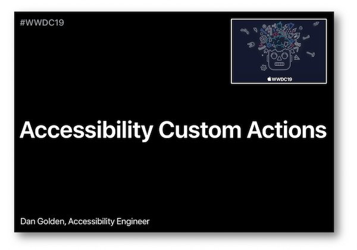
  Les thèmes abordés ainsi que leur référence temporelle au sein de la vidéo sont décrits ci-dessous :

- [Introduction](#introduction-0012) (00:12)

- <a role="button" style="text-decoration: underline" onclick="$('#CustomActions-VoiceOver_tab').trigger('click');document.getElementById('actions-personnalisees').scrollIntoView({ behavior: 'smooth', block: 'start' })">Actions personnalisées&nbsp;: lecteur d'écran</a> (03:10)

- <a role="button" style="text-decoration: underline" onclick="$('#CustomActions-SwitchControl_tab').trigger('click');document.getElementById('actions-personnalisees').scrollIntoView({ behavior: 'smooth', block: 'start' })">Actions personnalisées&nbsp;: contrôle de sélection</a> (04:28)

- [Implémentation](#implementation-0759) (07:59) ⟹ **nouveauté iOS 13**
   
### [Introduction (00:12)](https://developer.apple.com/videos/play/wwdc2019/250/?time=12)
Présentation rapide de VoiceOver ainsi que de la problématique liée à une implémentation insuffisante mise en exergue par l'application de démonstration utilisée tout au long de la session.
  
### Actions personnalisées
<ul class="nav nav-tabs" role="tablist">
    <li class="nav-item" role="presentation">
        <a class="nav-link active"
           data-toggle="tab" 
           href="#CustomActions-VoiceOver"
           id="CustomActions-VoiceOver_tab"
           role="tab" 
           aria-selected="true">Lecteur d'écran</a>
    </li>
    <li class="nav-item" role="presentation">
        <a class="nav-link" 
           data-toggle="tab" 
           href="#CustomActions-SwitchControl"
           id="CustomActions-SwitchControl_tab"
           role="tab" 
           aria-selected="false">Contrôle de sélection</a>
    </li>
</ul>

    
<a alt="Lien vers l'extrait vidéo au temps indiqué." href="https://developer.apple.com/videos/play/wwdc2019/250/?time=190">🎬 (03:10)</a>

L'intérêt des <a href="../../developpement#actions-personnalisees" style="text-decoration: underline;">actions&nbsp;personnalisées</a> avec VoiceOver est présenté de façon très pragmatique et particulièrement pédagogique de façon à comprendre pourquoi et dans quels contextes ce type de fonctionnalité doit absolument être mise en oeuvre pour améliorer significativement l'expérience utilisateur.

    
<a alt="Lien vers l'extrait vidéo au temps indiqué." href="https://developer.apple.com/videos/play/wwdc2019/250/?time=268">🎬 (04:28)</a>

L'application de démonstration est utilisée avec le contrôle de sélection dirigé par un appareil connecté en bluetooth au mobile et doté de deux boutons&nbsp;: le premier (blanc) permet l'activation alors que le second (orange) permet la sélection.

L'utilisation d'actions personnalisées dans ce contexte va permettre une **diminution drastique du nombre de sélections/activations** à réaliser par l'utilisateur pour aboutir à un même résultat.

  
### [Implémentation (07:59)](https://developer.apple.com/videos/play/wwdc2019/250/?time=479)
Depuis iOS&nbsp;8, la création d'[actions&nbsp;personnalisées](../../developpement#actions-personnalisees) s'appuie sur une syntaxe ObjectiveC qui s'est adaptée à Swift en incluant désormais une **closure en iOS&nbsp;13**.
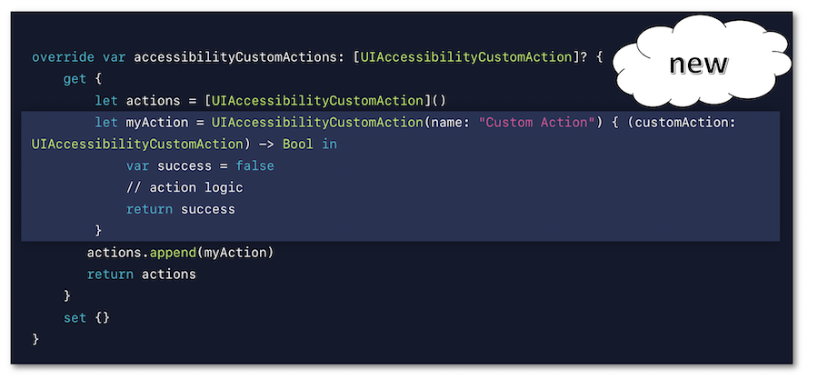
   
