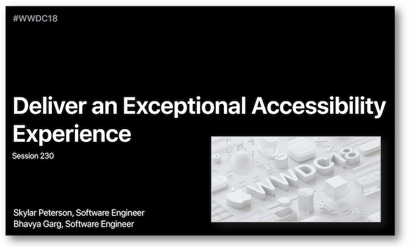

# WWDC : World Wide Developers Conference

Cette partie regroupe des [présentations faites à la WWDC](https://developer.apple.com/videos/) et liées à l'accessibilité.

Chacune de ces présentations est détaillée et comprend une description de chaque thème qui fait référence à une indication temporelle au sein de la vidéo.

La plupart des illustrations proviennent des supports de présentations fournies par Apple et sont disponibles dans la partie `Resources` de l'onglet `Overview` propre à chaque vidéo.

**L'accès au résumé de chacune de ces vidéos se fait en cliquant sur le titre ou directement sur l'image de présentation**.
   

## [2020 - Efficience du rotor](2020/116/)
Explications sur la mise en oeuvre du **rotor personnalisé** à l'aide d'une application pour laquelle l'implémentation des fonctionnalités est développée de façon détaillée.
<a href="2020/116/">
    

   

## [2020 - Accessibilité avec le contrôle de sélection](2020/019/)
Des améliorations significatives pour la **navigation avec le contrôle de sélection** sont passées en revue et parfaitement expliquées tant au niveau de leur fonctionnement que de leur implémentation.
<a href="2020/019/">
    

   

## [2020 - Rendre un visuel accessible](2020/020/)
Cette présentation met en avant un ensemble de critères et de méthodes pour permettre au visuel d'une application de devenir accessible.
<a href="2020/020/">
    

   

## [2019 - Large Content Viewer](2019/261/)
Cette courte vidéo concerne la fonctionnalité **Large Content Viewer** apparue avec iOS 11 et les nouveautés iOS 13 associées.
<a href="2019/261/">
    

   

## [2019 - Quelques enseignements en accessibilité](2019/)
Cette session regroupe quatre courtes interventions toutes liées à l'accessibilité.
<a href="2019/">
    

   

## [2018 - Fournir une expérience exceptionnelle en accessibilité](2018/230/)
Présentation de toutes les fonctionnalités qui vont permettre de créer une application accessible répondant parfaitement aux attentes des utilisateurs.

Le détail de leurs mises en oeuvre est exposé aux développeurs par le biais d'une démonstration de façon à saisir la logique à suivre quel que soit le contexte.
<a href="2018/230/">
    

   
    
## [2018 - Utiliser une voix synthétisée](2018/236/)
Cette très courte vidéo présente les éléments principaux à mettre en oeuvre pour implémenter une vocalisation synthétisée.
<a href="2018/236/">
    

   
    
## [2017 - Les nouveautés en accessibilité](2017/215/)
Présentation des nouvelles fonctionnalités d'accessibilité iOS 11 en associant la pratique de l'utilisateur à la conception du développeur.
<a href="2017/215/">
    

   

## [2017 - Application du Dynamic Type](2017/245/)
Permettre à l'utilisateur de déterminer la taille de texte nécessaire à son confort visuel et adapter son application à cette modification sont des éléments essentiels que le `Dynamic`&nbsp;`Type` met en avant.

Cette vidéo propose à la fois une approche théorique pour bien comprendre les possibilités offertes par le `Dynamic`&nbsp;`Type` ainsi qu'une partie purement pratique au niveau développeur pour lui éviter de tomber dans les écueils classiques de programmation.
<a href="2017/245/">
    

   

## [2016 - Les nouveautés en accessibilité](2016/202/)
Présentation des nouvelles fonctionnalités d'accessibilité iOS, MacOS, tvOS et WatchOS en associant la pratique de l'utilisateur à la conception du développeur.
<a href="2016/202/">
    

   
    
## [2016 - Audit d'une app en accessibilité](2016/407/)
Après un rappel sur le fonctionnement de VoiceOver au niveau programmatique, cette présentation va détailler les différentes fonctionnalités proposées par l'outil Accessibility Inspector de Xcode en s'appuyant sur un exemple très simple pour une mise en situation concrète.
<a href="2016/407/">
    

