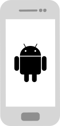

# Guide d’utilisation des lecteurs d’écran TalkBack et VoiceOver

À travers cette section, nous allons présenter les gestes de base pour une utilisation des lecteurs d’écran d’Android et iOS. Ces outils sont riches en fonctionnalités mais nécessitent une connaissance minimale pour être utilisés efficacement. C’est cette utilisation standard qui sera présentée ici.

Deux versions sont disponibles&nbsp;:
- **TalkBack** le lecteur d’écran intégré à Android.
- **VoiceOver**  le lecteur d’écran intégré à iOS.

    <h2 class="sr-only">TalkBack</h2>          
    <a href="./screen-reader-talkback.html" class="btn btn-info">
        
        
Guide d’utilisation de TalkBack

    </a>

    <h2 class="sr-only">Voiceover</h2>          
    <a href="./lecteur-ecran-voiceover.html" class="btn btn-info">
        
        
Guide d’utilisation de VoiceOver

    </a>

      
