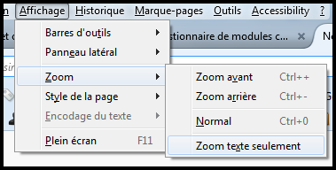

# Agrandissement de la taille du texte

## Comment on teste ?

Une des recommandations d’accessibilité est la possibilité pour l’utilisateur d’agrandir la taille du texte à 200%. Il s’agit bien d’agrandir uniquement le texte et non l’ensemble de la page. En effet, si vous utilisez le zoom par défaut du navigateur, toute la page est agrandie, ce qui entraîne l’apparition systématique d’ascenseurs horizontaux et verticaux. La lecture d’un article de blog par exemple devient fastidieuse puisqu’il faut jouer constamment avec l’ascenseur horizontal.

L’agrandissement du texte seul, n’entraîne pas systématiquement l’apparition de barres de défilement horizontale. Vous devez vérifier qu’a ce niveau de zoom (200%), le texte reste lisible. Aucun texte ne doit être tronqué, ni superposé. L’information doit rester accessible même si la présentation peut être quelque peu altérée.

Pour agrandir le texte uniquement, il faut cocher l’option «&nbsp;zoom texte seulement&nbsp;» dans Firefox. Pour agrandir le texte de 200%, faire <kbd>Ctrl&nbsp;:+</kbd> quatre fois. 
  
 

## Quelles conséquences sur le développement ?

Si votre page ne s’affiche pas correctement lorsque vous agrandissez le texte, il se peut que ceci soit lié à l’utilisation du pixel comme unité pour dimensionner la taille des textes et la taille des éléments (hauteur ou largeur des `div`…).
Pour corriger les problèmes d’affichage lorsque le zoom est à 200%, il ne s’agit pas nécessairement de tout revoir et de supprimer les pixels définitivement. L’idée est de revoir uniquement les éléments qui posent un problème (remplacer les `px` par des `em`, `rem` ou `%`).

**Exemple zoom à 100%**  

**Exemple zoom à 200% et taille en pixels**  
La hauteur des éléments n’étant pas fonction de la taille du texte, ceux-ci ne s’agrandissent pas.

  
**Exemple zoom à 200% et hauteur des éléments en unités relatives (`rem`)**  
La hauteur des éléments contenant le texte a été renseignée avec une unité relative qui varie en fonction de la taille du texte (`rem`). Les éléments s’agrandissent, le texte reste lisible.

Plus d’information dans la rubrique **exemples**&nbsp;: [gestion de l’agrandissement de la taille du texte à 200%](../..//exemples-de-composants/zoom/).  
